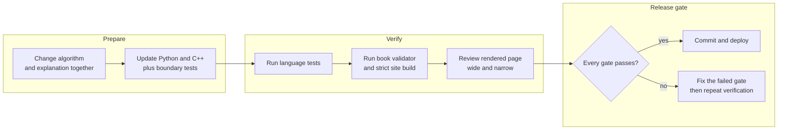

# Contributing

Treat the diagram as a set of release gates. A correct algorithm with a stale
explanation—or a polished page with untested code—is not complete.

## Content change

1. Edit the relevant `docs/chapter_*` page.
2. State the selection signal, invariant, complexity, and boundary cases.
3. Link to executable code rather than embedding an untested duplicate.
4. Run the strict MkDocs build and book validator.

## Algorithm change

1. Update Python and/or C++ source under `codes/`.
2. Add a normal, boundary, and regression test.
3. Keep public names descriptive and avoid LeetCode-specific wrapper classes in
   the reusable library.
4. Update the chapter when the contract or complexity changes.

## New chapter

Every chapter needs YAML front matter with a description, a single `h1`, and a
navigation entry in `mkdocs.yml`. Prefer one complete chapter over many shallow
pages.

## Quality bar

- Examples compile or import.
- Preconditions are explicit.
- Numeric ranges are safe.
- The invariant matches the implementation.
- Complexity includes auxiliary and recursion space.
- Local links resolve.
- Generated output is not committed.
