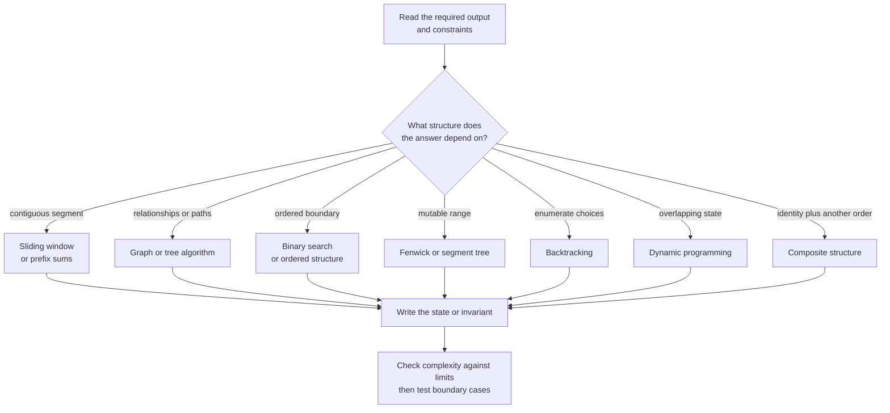

# Quick reference

## Fast pattern router



Use this as a shortlist generator, not an automatic answer. The tables below
help refine the choice after the first family is identified.

| Signal | Pattern | Invariant to write | Typical cost |
| --- | --- | --- | --- |
| complement / count | hash map | map describes processed prefix | `O(n)` expected |
| contiguous validity | sliding window | current window is valid/minimal | `O(n)` |
| next greater/smaller | monotonic stack | unresolved values are monotone | `O(n)` |
| fixed-window extrema | monotonic deque | live candidates ordered by value | `O(n)` |
| sorted exact lookup | binary search | target remains in interval | `O(log n)` |
| monotone feasibility | first-true search | false prefix excluded | `O(log range × check)` |
| unweighted shortest path | BFS | queue order is nondecreasing distance | `O(V+E)` |
| nonnegative weighted path | Dijkstra | non-stale pop is final | `O((V+E) log V)` |
| dependency order | topological sort | queue holds remaining zero-indegree nodes | `O(V+E)` |
| dynamic connectivity | DSU | each component has one root | near `O(1)` amortized |
| pointer rewiring | linked list | reversed/merged prefix is complete | `O(n)` |
| maximum compatible intervals | greedy by finish | chosen prefix leaves maximum room | `O(n log n)` |
| exact string pattern | KMP | matched length is a pattern prefix | `O(text + pattern)` |
| dictionary prefixes | Trie | path spells exactly the consumed prefix | `O(key length)` |
| point add + range sum | Fenwick tree | node owns its lowbit-sized range | `O(log n)` |
| general range aggregate | segment tree | parent merges its child ranges | `O(log n)` |
| directed mutual reachability | SCC | component vertices reach one another | `O(V+E)` |
| maximum capacity routing | Dinic | residual edges preserve feasible rerouting | `O(V²E)` worst case |
| tree ancestor queries | binary lifting | `up[k][v]` is the `2^k` ancestor | `O(log V)` query |
| enumerate choices | backtracking | path equals current branch | output-dependent |
| overlapping subproblems | DP | state has exact declared meaning | states × transitions |

## Boundary audit

- empty and singleton input;
- duplicates and all-equal values;
- answer at the first or last position;
- no answer, if permitted;
- disconnected or cyclic graph;
- maximum numeric values and overflow;
- recursion depth;
- mutation of caller-owned input.

## Binary search contracts

```text
Exact match: [lo, hi], while lo <= hi, return index or -1
First true:  [lo, hi), while lo < hi, return lo (possibly n)
Answer:      [known lower, known feasible], return smallest feasible
```

## Graph chooser

```text
Traversal/reachability         -> DFS or BFS
Fewest equal-cost transitions  -> BFS
Weights in {0, 1}              -> 0–1 BFS
Nonnegative weights            -> Dijkstra
Negative edges                 -> Bellman–Ford
All pairs, small graph         -> Floyd–Warshall
Dependency ordering            -> topological sort
Dynamic connectivity / MST     -> DSU
Mutual directed regions        -> SCC
Repeated LCA / tree path facts -> binary lifting
Maximum assignment / routing   -> network flow
One target + good lower bound  -> A*
```

## Composite ownership map

| Required operations | Combination | Synchronization invariant |
| --- | --- | --- |
| key lookup + recency eviction | hash map + doubly linked list | same live keys in both |
| lookup + random choice | hash map + dense array | map stores each live array index |
| streaming median | max-heap + min-heap | lower values ≤ upper values; sizes differ ≤ 1 |
| historical value by time | hash map + sorted history | histories increase by timestamp |
| smallest index by assigned value | two maps + set/heap | reverse index agrees with current assignment |
| sparse versions | per-index histories + binary search | newest entry not after snapshot is visible |

## Representation chooser

```text
Ordered predecessor/successor  -> balanced BST / ordered map
Small binary feature set       -> bit mask
Many prefix queries            -> Trie
Low-dimensional spatial query  -> KD tree (watch worst case/dimension)
Static range sums              -> prefix sums
Mutable prefix/range sums      -> Fenwick tree
Mutable general range merge    -> segment tree
```

See the [problem catalog](problem_catalog.md) for practice grouped by signal.
