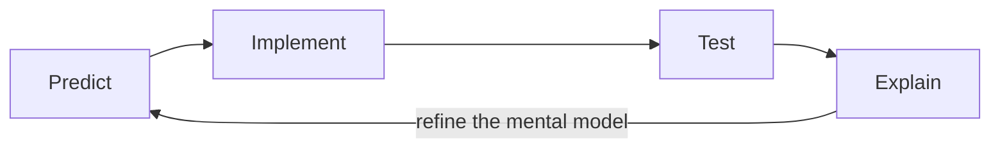
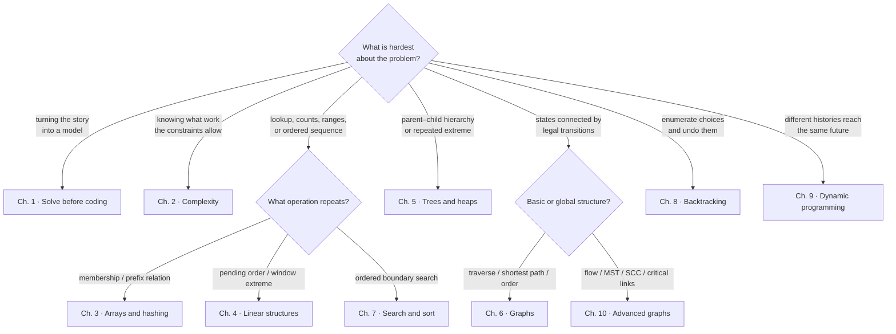

# Chapter 0 · How to use this book

DSA skill grows through a short feedback loop: predict, implement, test, and
explain. Reading a solution can create familiarity without creating recall.
This book therefore separates each topic into four artifacts:



1. **Signal** — what wording or input shape suggests the pattern.
2. **Invariant** — what remains true during execution.
3. **Implementation** — a compact C++17 and Python 3 reference.
4. **Test** — a normal case, a boundary, and a hostile case.

## Where should I go next?

Use the shape of the uncertainty—not the story in the prompt—to choose the
next chapter.



If two branches look plausible, start with
[Chapter 1](../chapter_01_problem_solving/index.md): name the repeated expensive
operation and the proof condition that would make a pattern valid. Use
[Chapter 2](../chapter_02_complexity/index.md) to eliminate candidates that
cannot fit the constraints.

## A 45-minute study block

| Minutes | Activity | Output |
| ---: | --- | --- |
| 0–5 | Restate one problem | Inputs, output, and ambiguity list |
| 5–10 | Derive a complexity budget | Maximum affordable work |
| 10–20 | Write brute force and identify waste | Expensive repeated operation |
| 20–35 | Implement the chosen pattern | Working code with invariant comments |
| 35–42 | Test boundaries | Empty, singleton, duplicate, extreme |
| 42–45 | Explain aloud | Why it is correct and its complexity |

## Use both languages deliberately

Python is excellent for exposing the state transition with little syntax.
C++ makes ownership, numeric range, and container cost harder to ignore. You do
not need to solve every problem twice, but compare both implementations after
you can explain the algorithm.

## Reading code from the book

The source tree is intentionally conventional:

```text
codes/python/dsa_atlas/   # importable package
codes/cpp/include/        # reusable C++17 headers
tests/python/             # Python behavior tests
codes/cpp/tests/          # C++ executable tests
```

Run tests before and after changing an implementation. A green docs build only
proves the book renders; the language tests prove the core behavior.

## Progress rule

Do not memorize a template you cannot annotate. For every loop, name:

- what the indices or queue contain;
- what has already been proved;
- what work remains;
- why the update makes progress.

Continue with [the solve loop](../chapter_01_problem_solving/index.md).
