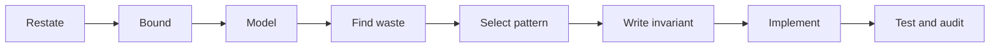

# Chapter 1 · Solve before coding

The story in a problem is often camouflage. Translate it into structure,
operations, and constraints before naming an algorithm.

## The eight-step loop



### 1. Restate

Write one sentence containing the input, output, and validity rule. Clarify
duplicates, mutation, empty input, and whether a valid answer must exist.

### 2. Bound

Convert the largest input into a rough operation budget:

| Maximum `n` | First family to consider |
| ---: | --- |
| `20` | exponential search, bitmask DP |
| `200` | cubic, depending on constant factors |
| `2,000` | quadratic |
| `100,000` | `O(n log n)` or `O(n)` |
| `1,000,000` | linear or near-linear |

These are interview heuristics, not hardware guarantees.

### 3. Model

Ask what carries the state:

- sequence or contiguous range;
- tree or hierarchy;
- graph of relationships;
- grid of implicit neighbors;
- subset, position, or capacity state.

### 4. Find waste

Start from brute force. Circle the repeated scan, repeated subproblem, repeated
minimum lookup, or repeated connectivity query. The bottleneck often names the
data structure.

### 5. Select a pattern

| Repeated need | Structure or pattern |
| --- | --- |
| membership / complement | hash map or set |
| next best candidate | heap |
| oldest pending state | queue |
| newest unresolved state | stack |
| contiguous validity | sliding window |
| monotone decision | binary search |
| overlapping subproblems | dynamic programming |

### 6. Write the invariant

An invariant is a testable statement, not a slogan. Prefer “every index before
`left` has been proved invalid” over “the pointers are correct.”

### 7. Implement

Choose variable names from the proof: `left`, `right`, `distance`,
`indegree`, `parent`, `best`. Hide mechanics in helpers only when the helper has
a crisp contract.

### 8. Test and audit

Trace:

- the smallest valid input;
- duplicates or equal values;
- a solution at each boundary;
- no solution, when allowed;
- maximum numeric values;
- a shape that drives worst-case behavior.

Finally recompute time and auxiliary space from the code actually written.

## Worked example: from waste to invariant

For Two Sum, brute force scans the remaining suffix for the needed complement
at every index. The repeated operation is membership lookup, so a hash map owns
that operation.

**Invariant:** before processing index `i`, the map contains one earlier index
for every value seen in `values[:i]`. Checking before inserting prevents an
element from matching itself.

=== "Python"

    ```python
    --8<-- "codes/python/dsa_atlas/arrays.py:two-sum"
    ```

=== "C++17"

    ```cpp
    --8<-- "codes/cpp/include/dsa_atlas/algorithms.hpp:two-sum"
    ```

Trace `[3, 3]` with target `6`: the first `3` is stored, then the second finds
its complement at index `0`. This simultaneously tests duplicates and the
distinct-index rule.

!!! tip "Interview narration"

    State the brute force, name its repeated waste, explain which operation the
    chosen structure makes cheap, then state the invariant. This is clearer
    than guessing an algorithm name immediately.
