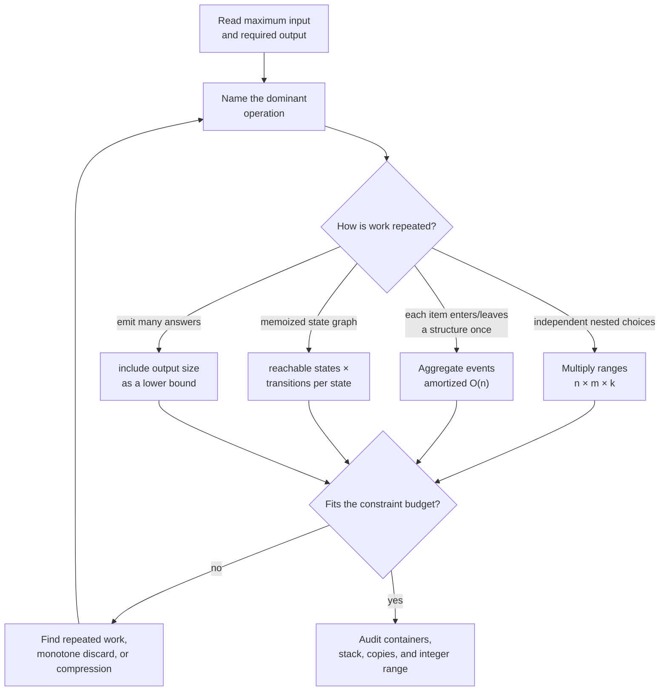

# Chapter 2 · Complexity and constraints

Complexity is a design constraint. It tells you which solution families are
still possible before implementation begins.

## Thinking flow · Audit a proposed solution



This flow prevents two common mistakes: multiplying loops that are actually
amortized, and reporting only the table-fill loop while ignoring the number of
states or transitions.

## Count the dominant operation

Ignore syntax and count how often the expensive action executes.

```python
for right, value in enumerate(values):
    while left <= right and window_is_invalid():
        left += 1
```

The nested `while` does not automatically make this quadratic. If `left` only
moves forward, it advances at most `n` times across the entire run. The total is
`O(n)`.

## Common bounds

| Pattern | Time | Auxiliary space |
| --- | ---: | ---: |
| Hash scan | `O(n)` expected | `O(n)` |
| Sort then scan | `O(n log n)` | language-dependent |
| Binary search | `O(log n)` | `O(1)` iterative |
| BFS / DFS | `O(V + E)` | `O(V)` |
| Heap top-k | `O(n log k)` | `O(k)` |
| 0/1 knapsack | `O(nW)` | `O(W)` |
| Subset enumeration | `O(n 2^n)` | output-dependent |

## Hidden costs worth naming

- Python list membership is `O(n)`; set membership is expected `O(1)`.
- Slicing copies in Python and often changes the claimed space bound.
- C++ `map` is `O(log n)` while `unordered_map` is expected `O(1)`.
- Recursion uses call-stack space even when no explicit container appears.
- Sorting can mutate input and may violate the problem contract.
- String concatenation inside a loop may repeatedly copy.

## Numeric safety

Complexity can be right while arithmetic is wrong. In C++, widen before adding:

```cpp
double median = (static_cast<double>(left) + right) / 2.0;
```

Casting after `left + right` is too late because overflow has already happened.
For distances, choose an infinity sentinel that leaves headroom for addition
and guard unreachable states before relaxing an edge.

## Amortized analysis

A monotonic stack can pop many elements in one iteration, but each element is
pushed once and popped once. Dynamic arrays occasionally reallocate, yet
append remains amortized `O(1)`. State the amortized bound when the occasional
operation is expensive but the full sequence is cheap.

## Space audit

Separate:

- input storage;
- output storage required by the problem;
- auxiliary containers;
- recursion depth;
- copied inputs or slices.

This makes explanations precise and prevents claiming `O(1)` space while a
recursive call chain grows to `O(n)`.
