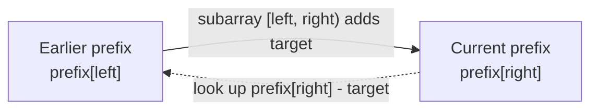

# Chapter 3 · Arrays and hashing

Arrays preserve order and give constant-time indexing. Hash tables trade order
for expected constant-time lookup. Many sequence problems become linear when a
repeated scan is replaced by remembered state.

## Complement lookup

For two-sum-style problems, scan once. Before storing the current value, ask
whether its complement appeared earlier.

**Invariant:** the map contains exactly the values strictly before the current
index.

=== "Python"

    ```python
    --8<-- "codes/python/dsa_atlas/arrays.py:two-sum"
    ```

=== "C++17"

    ```cpp
    --8<-- "codes/cpp/include/dsa_atlas/algorithms.hpp:two-sum"
    ```

Checking before insertion prevents reusing the same element.

## Prefix-sum frequency

Let `prefix[j]` be the sum before position `j`. A subarray ending at the current
position sums to `target` when an earlier prefix equals
`current_prefix - target`.



**Invariant:** `seen` counts prefix sums from positions strictly before the
current endpoint.

=== "Python"

    ```python
    --8<-- "codes/python/dsa_atlas/arrays.py:prefix-sum"
    ```

=== "C++17"

    ```cpp
    --8<-- "codes/cpp/include/dsa_atlas/algorithms.hpp:prefix-sum"
    ```

Initialize the empty prefix with count one. Without it, subarrays beginning at
index zero disappear.

## Two pointers

Two pointers work when pointer movement can permanently discard candidates.
In a sorted pair-sum search:

- a sum that is too small proves the current left value cannot work with any
  smaller right value;
- a sum that is too large proves the current right value cannot work with any
  larger left value.

If you cannot justify the discard, two pointers is only a guess.

## Frequency map checklist

- Does the answer depend on counts or only membership?
- Must you retain the earliest, latest, or every index?
- Can duplicates overwrite safely?
- Does the map represent the past only, or the full input?
- Is expected hash behavior acceptable?
