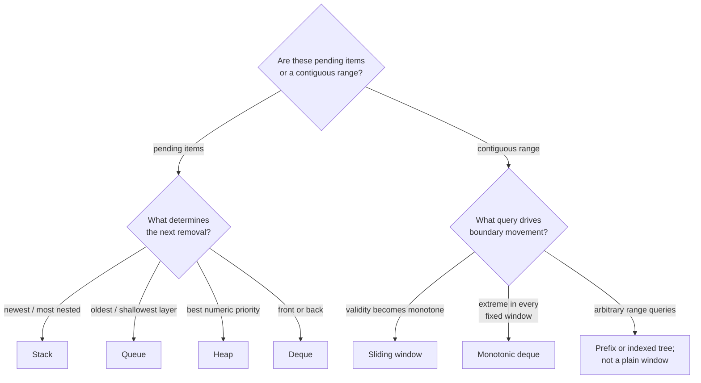
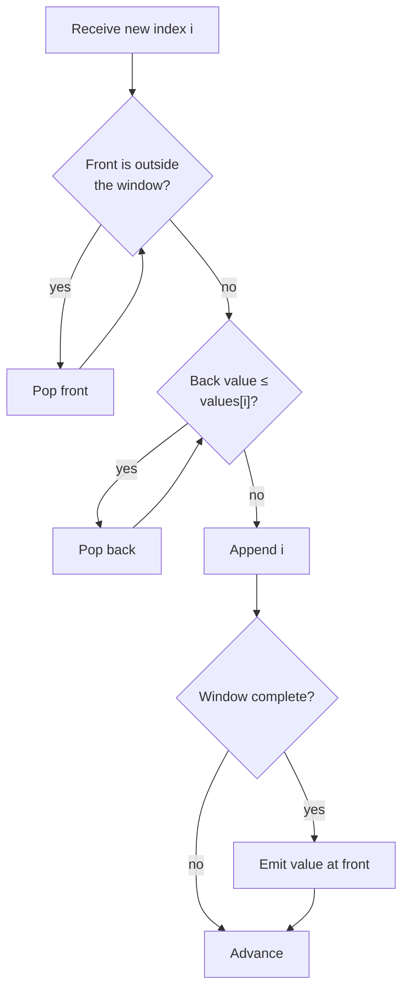

# Chapter 4 · Stacks, queues, and windows

Choose a linear structure by asking which pending item must leave next.

| Required removal order | Structure | Typical signals |
| --- | --- | --- |
| newest first | stack | nesting, undo, next greater, DFS |
| oldest first | queue | levels, arrival order, BFS |
| best priority first | heap | repeated min/max, top-k, Dijkstra |
| either end | deque | window extrema, 0–1 BFS |

## Thinking flow · Which item must leave next?



The structure is chosen by the removal contract. DFS and BFS, for example, may
visit the same states; stack versus queue changes which pending state is
expanded next.

## Monotonic deque

For the maximum of every fixed-size window, the deque stores indices, not
values. Indices are needed to expire old entries.

**Invariant:** indices are live, ordered by position, and their values decrease
from front to back.



=== "Python"

    ```python
    --8<-- "codes/python/dsa_atlas/arrays.py:sliding-window"
    ```

=== "C++17"

    ```cpp
    --8<-- "codes/cpp/include/dsa_atlas/algorithms.hpp:sliding-window"
    ```

=== "C++11"

    ```cpp
    --8<-- "codes/cpp/include/dsa_atlas/algorithms.hpp:sliding-window"
    ```

Every index enters and leaves at most once, so the total time is `O(n)`.

## Stack as unresolved work

A monotonic stack stores candidates whose answer has not yet appeared. When a
new value dominates the top, resolve and pop until the invariant returns.

For “next greater element,” the stack usually stores indices so the result can
record positions or distances. Decide whether equal values should pop by
reading the exact comparison rule.

## Heap as a bounded frontier

To keep the `k` largest values, maintain a min-heap of size at most `k`.
The root is the weakest survivor. Each new value enters, and an excess root is
removed.

**Invariant:** after processing any prefix, the heap contains its `k` largest
values (or the entire prefix if it contains fewer than `k` values).

## Boundary questions

- Is the window fixed or variable?
- Does validity change monotonically as the left edge moves?
- Do equal values dominate one another?
- Must stale heap entries be removed lazily?
- Can `k` be zero or larger than the input?
