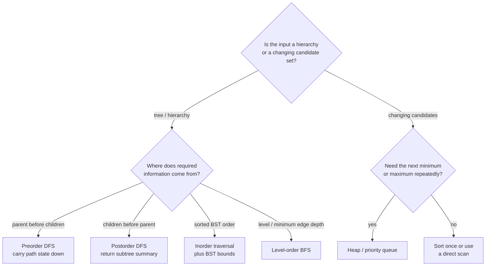
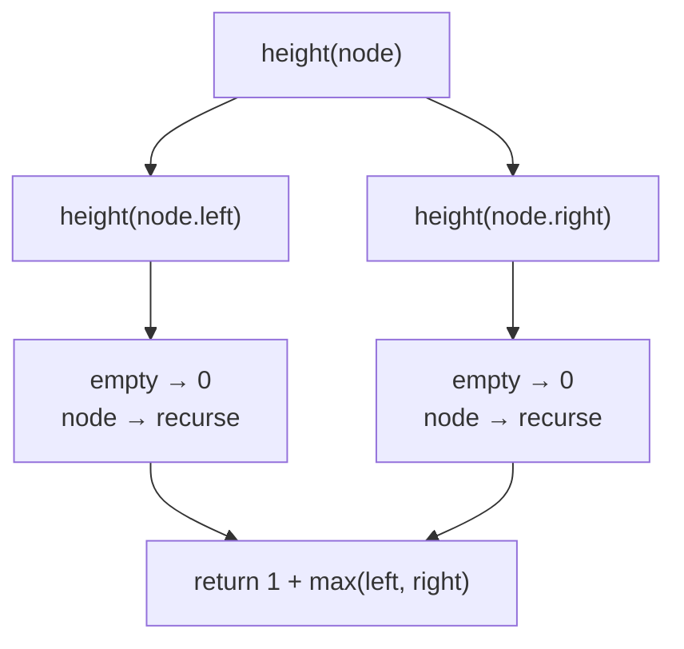

# Chapter 5 · Trees and heaps

A tree problem becomes easier when the recursive function has a one-sentence
contract.

## Thinking flow · What information must move?



Choose the dependency direction before choosing recursive or iterative syntax.
Both mechanisms can implement preorder or postorder; the contract determines
which order is correct.

```text
dfs(node) returns the height of the complete subtree rooted at node.
```



From that contract:

1. the empty subtree returns zero;
2. recursively obtain left and right heights;
3. return one plus their maximum.

=== "Python"

    ```python
    --8<-- "codes/python/dsa_atlas/trees.py:tree-height"
    ```

=== "C++17"

    ```cpp
    --8<-- "codes/cpp/include/dsa_atlas/algorithms.hpp:tree-height"
    ```

=== "C++11"

    ```cpp
    --8<-- "codes/cpp/include/dsa_atlas/algorithms.hpp:tree-height"
    ```

The base case and return statement are direct translations of the contract.
For a chain of three nodes the calls return `1`, then `2`, then `3`; for an
empty root they return `0`.

## Traversal order follows dependency

| Need | Order |
| --- | --- |
| consume parent before children | preorder |
| sorted order in a BST | inorder |
| aggregate children into parent | postorder |
| minimum edge count from root | level-order BFS |

Do not choose recursive vs iterative first. Choose the information dependency,
then select a mechanism.

## Recursive safety

Recursive DFS uses `O(h)` call-stack space. A balanced tree has
`h = O(log n)`; a chain has `h = O(n)`. Python can reach its recursion limit,
and C++ can exhaust the process stack. Use an explicit stack when depth is not
bounded.

## Binary search tree invariant

For every node:

- every key in the left subtree is smaller;
- every key in the right subtree is larger;
- the duplicate policy is explicit.

Passing lower and upper bounds through recursion is safer than checking only
the immediate children.

## Heap mental model

A heap guarantees only that the root is extreme. It does not keep the complete
container sorted. Use it when the repeated operation is “give me the next
smallest/largest live candidate.”

For streaming medians, maintain:

- a max-heap for the lower half;
- a min-heap for the upper half;
- an ordering invariant between halves;
- a size difference of at most one.

When averaging two C++ `int` tops, convert before addition to avoid overflow.
The tested implementation is in
[`structures.py`](https://github.com/buicongnguyen/Leetcode/blob/main/codes/python/dsa_atlas/structures.py)
and its C++ counterpart in `algorithms.hpp`.
