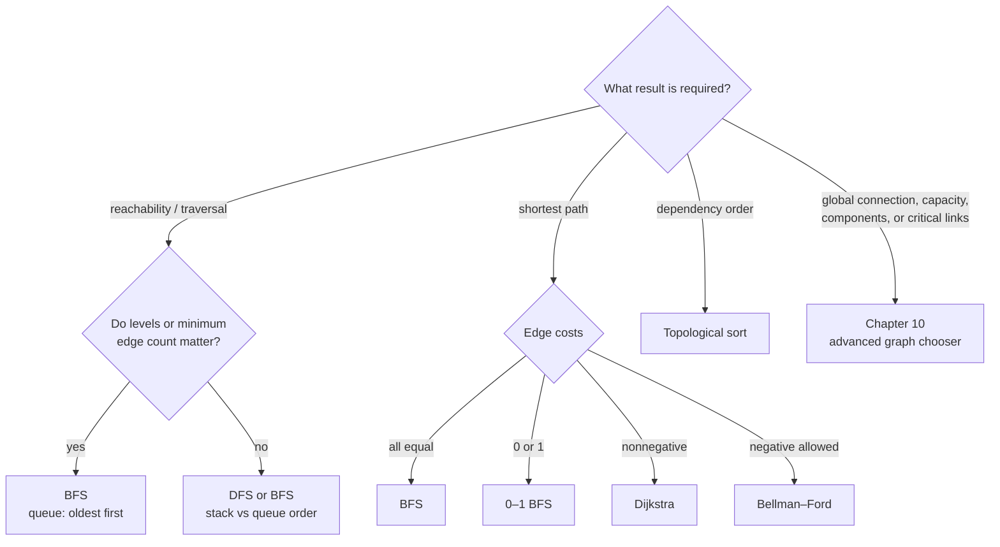

# Chapter 6 · Graphs

A graph is a set of states and legal transitions. Many problems never use the
word “graph”: grids, word transformations, lock combinations, schedules, and
game positions all qualify.

## Choose by edge meaning



DFS and BFS visit the same reachable vertices. Their order is the distinction:
DFS commits down one branch using a call stack or explicit stack; BFS expands
one distance layer at a time using a queue.

Use the [Advanced Graphs chooser](../chapter_10_advanced_graphs/index.md) when
the requested result is a minimum spanning tree, maximum flow, strongly
connected components, all-pairs paths, bridges/articulation points, or repeated
ancestor query rather than ordinary traversal.

## BFS distances

**Invariant:** vertices leave the queue in nondecreasing distance from the
source. The first discovery of a vertex gives its shortest unweighted distance.

=== "Python"

    ```python
    --8<-- "codes/python/dsa_atlas/graph.py:bfs"
    ```

=== "C++17"

    ```cpp
    --8<-- "codes/cpp/include/dsa_atlas/algorithms.hpp:bfs"
    ```

Mark a vertex when enqueuing, not when dequeuing, or the queue may contain many
duplicates.

## Dijkstra

Dijkstra requires nonnegative edge weights.

**Invariant:** when a non-stale `(distance, vertex)` pair leaves the min-heap,
that distance is final.

=== "Python"

    ```python
    --8<-- "codes/python/dsa_atlas/graph.py:dijkstra"
    ```

=== "C++17"

    ```cpp
    --8<-- "codes/cpp/include/dsa_atlas/algorithms.hpp:dijkstra"
    ```

Multiple heap entries for one vertex are normal. Skip an entry whose distance
no longer equals the best known distance.

## Topological order

Kahn's algorithm repeatedly removes zero-indegree vertices. If fewer than `n`
vertices are removed, the graph contains a directed cycle; returning the
partial list as a valid order is a correctness bug.

=== "Python"

    ```python
    --8<-- "codes/python/dsa_atlas/graph.py:topological-order"
    ```

=== "C++17"

    ```cpp
    --8<-- "codes/cpp/include/dsa_atlas/algorithms.hpp:topological-order"
    ```

## Bridge edges

An undirected edge is a bridge when its child subtree cannot reach the parent
or any ancestor without using that same edge. Parallel edges require edge IDs:
skipping every edge to the parent vertex incorrectly reports a bridge.

The tested library implementation tracks the exact parent edge and includes a
parallel-edge regression case.

=== "Python"

    ```python
    --8<-- "codes/python/dsa_atlas/graph.py:bridges"
    ```

=== "C++17"

    ```cpp
    --8<-- "codes/cpp/include/dsa_atlas/algorithms.hpp:bridges"
    ```
