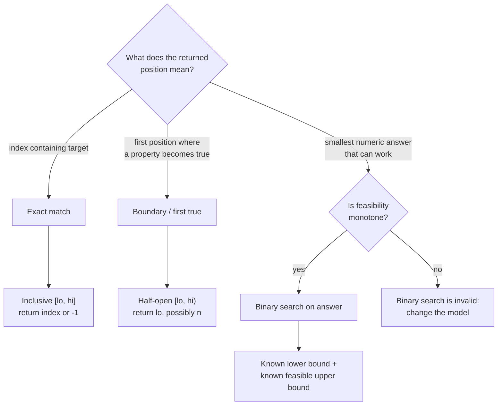

# Chapter 7 · Search and sort

Binary search is not one template. Decide what the final position means before
choosing boundaries.

## Three binary-search families

| Family | Search interval | Result |
| --- | --- | --- |
| exact match | inclusive `[lo, hi]` | matching index or `-1` |
| first true | half-open `[lo, hi)` | first position satisfying predicate |
| answer space | known bounded candidates | smallest feasible value |



All three repeatedly discard half of an ordered candidate set, but they cannot
share boundaries blindly because their return contracts differ.

### Exact match

**Invariant:** if the target exists, it remains inside the inclusive search
interval.

=== "Python"

    ```python
    --8<-- "codes/python/dsa_atlas/search.py:binary-search"
    ```

=== "C++17"

    ```cpp
    --8<-- "codes/cpp/include/dsa_atlas/algorithms.hpp:binary-search"
    ```

=== "C++11"

    ```cpp
    --8<-- "codes/cpp/include/dsa_atlas/algorithms.hpp:binary-search"
    ```

### First true

The predicate must be monotone:

```text
false false false true true true
                  ^
              first true
```

**Invariant:** every position before `lo` is false, and the first true position
remains in `[lo, hi)`. Returning `n` is meaningful: no position is true.

=== "Python"

    ```python
    --8<-- "codes/python/dsa_atlas/search.py:first-true"
    ```

=== "C++17"

    ```cpp
    --8<-- "codes/cpp/include/dsa_atlas/algorithms.hpp:first-true"
    ```

=== "C++11"

    ```cpp
    --8<-- "codes/cpp/include/dsa_atlas/algorithms.hpp:first-true"
    ```

## Binary search on the answer

Use this when:

1. the answer is numeric or ordered;
2. you can test feasibility for a candidate;
3. feasibility changes monotonically;
4. you know an inclusive range containing at least one feasible candidate.

Write and test the feasibility function separately. Its complexity multiplies
the logarithmic search count.

## Sorting as a structural transformation

Sorting is useful when order makes candidate elimination provable: merge
intervals, two pointers, sweep lines, greedy scheduling, and adjacency-based
duplicate skipping. Record whether sorting mutates input and whether original
indices must be retained.

## Practice ladder · write the search contract

| Rung | Problem | Thinking prompt |
| --- | --- | --- |
| 1 | [Binary Search](https://leetcode.com/problems/binary-search/) | What exactly means “not found”? |
| 2 | [Find First and Last Position](https://leetcode.com/problems/find-first-and-last-position-of-element-in-sorted-array/) | Which two monotone boundaries define the answer? |
| 3 | [Search in Rotated Sorted Array](https://leetcode.com/problems/search-in-rotated-sorted-array/) | Which half is provably sorted this iteration? |
| 4 | [Koko Eating Bananas](https://leetcode.com/problems/koko-eating-bananas/) | Why does feasibility stay true above the boundary? |

State the interval style and final return meaning before calculating a midpoint.
