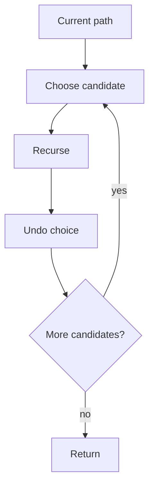

# Chapter 8 · Backtracking

Backtracking explores a decision tree while storing only the current path. Each
call owns a precise prefix of choices.



## Core invariant

`path` contains exactly the choices made on the current root-to-node branch.
The undo step must restore the state seen before the choice.

## Subsets with duplicates

Adjacent duplicate skipping has a precondition: candidates must be sorted.
Skip a duplicate only when it appears later in the *same decision layer*.

=== "Python"

    ```python
    --8<-- "codes/python/dsa_atlas/backtracking.py:subsets"
    ```

=== "C++17"

    ```cpp
    --8<-- "codes/cpp/include/dsa_atlas/algorithms.hpp:subsets"
    ```

The condition `i > start` preserves the ability to choose the same value at a
deeper layer while preventing identical sibling branches.

## Pruning

A prune is valid only when no completion below the current state can beat or
satisfy the answer. Common proofs use:

- a capacity already exceeded;
- a lower bound already worse than the best answer;
- remaining values unable to reach a target;
- a constraint violated by every extension.

Avoid changing shared state in the prune condition unless its restoration is
obvious.

## Complexity

State the number of candidate states and the work per emitted answer. For
subsets, there are `2^n` outputs and copying each path can make the total
`O(n 2^n)`.
