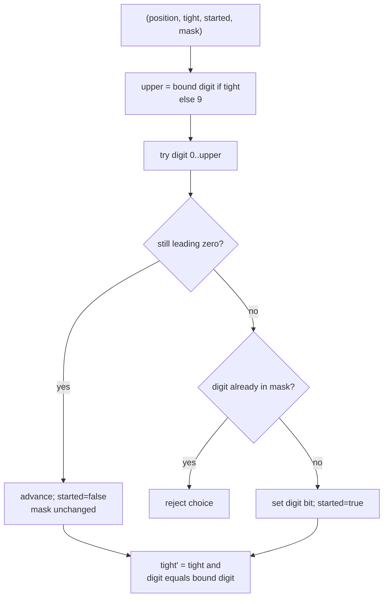
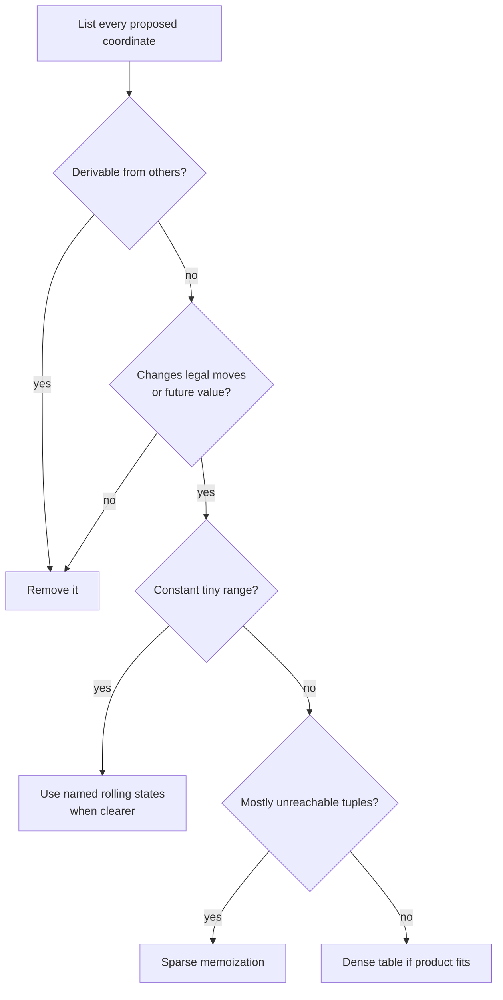

# Higher-dimensional DP · Tuples, masks, and digits

Four or more state coordinates are sometimes necessary, but a dense N-D array
is rarely the best first representation. Write a named tuple state, multiply
the coordinate ranges, and cache only reachable states.

## The dimensionality budget

For a state `(x1, x2, ..., xd)`:

> maximum states = `size(x1) × size(x2) × ... × size(xd)`

> time = reachable states × choices tried per state

Small boolean dimensions can be cheap. A bitmask dimension is not: a mask over
`n` objects has `2ⁿ` values.

| State | Approximate state count |
| --- | ---: |
| `(day, transaction, holding)` | `n × k × 2` |
| `(position, tight, started, digit_mask)` | `digits × 2 × 2 × 1024` |
| `(mask, last)` | `2ⁿ × n` |
| `(index, budget1, budget2, mode)` | `n × B1 × B2 × modes` |

Use constraints as a design tool. `n <= 16` often permits a `2ⁿ` dimension;
`n = 100` does not.

## Sparse tuple memoization

A tuple preserves meaning and avoids allocating unreachable combinations.

=== "Python"

    ```python
    from functools import cache

    @cache
    def solve(index, budget_a, budget_b, mode):
        # This key contains every fact that changes future choices.
        if index == item_count:
            return terminal_value(budget_a, budget_b, mode)

        best = solve(index + 1, budget_a, budget_b, mode)
        if can_take(index, budget_a, budget_b, mode):
            # Update each affected coordinate in one visible transition.
            best = max(
                best,
                item_value[index]
                + solve(
                    index + 1,
                    budget_a - cost_a[index],
                    budget_b - cost_b[index],
                    next_mode(mode),
                ),
            )
        return best
    ```

=== "C++17"

    ```cpp
    // A tuple key keeps the state contract visible during development.
    using State = std::tuple<int, int, int, int>;
    std::map<State, long long> memo;

    std::function<long long(int, int, int, int)> solve =
        [&] (int index, int budget_a, int budget_b, int mode) -> long long {
      const State state{index, budget_a, budget_b, mode};
      if (const auto found = memo.find(state); found != memo.end()) {
        return found->second;  // Only reachable tuples occupy memory.
      }
      // Add problem-specific base cases and transitions here.
      return memo[state] = evaluate_transitions(state);
    };
    ```

=== "C++11"

    ```cpp
    // C++11 names the iterator type because if-initializers arrived later.
    typedef std::tuple<int, int, int, int> State;
    std::map<State, long long> memo;

    std::function<long long(int, int, int, int)> solve =
        [&] (int index, int budget_a, int budget_b, int mode) -> long long {
      const State state(index, budget_a, budget_b, mode);
      std::map<State, long long>::iterator found = memo.find(state);
      if (found != memo.end()) {
        return found->second;  // Only reachable tuples occupy memory.
      }
      // Add problem-specific base cases and transitions here.
      return memo[state] = evaluate_transitions(state);
    };
    ```

Once correct, encode a tuple into an integer or dense table only if profiling or
constraints justify it.

## Digit DP · A practical 4D state

Digit DP counts numbers satisfying a property without enumerating every number.
For LeetCode
[Count Special Integers](https://leetcode.com/problems/count-special-integers/),
count positive numbers `<= limit` with no repeated digit.

Use:

> `solve(position, tight, started, used_mask)` = number of valid suffixes.

| Coordinate | Meaning |
| --- | --- |
| `position` | digit currently being chosen |
| `tight` | chosen prefix still equals the limit’s prefix |
| `started` | a non-leading-zero digit has been placed |
| `used_mask` | digits already used in the real number |



Leading zeros need special treatment. The representation `0007` should not
consume digit zero three times, and the all-zero path should not count as a
positive integer.

=== "Python"

    ```python
    --8<-- "codes/python/dsa_atlas/dp.py:digit-dp"
    ```

=== "C++17"

    ```cpp
    --8<-- "codes/cpp/include/dsa_atlas/algorithms.hpp:digit-dp"
    ```

=== "C++11"

    ```cpp
    --8<-- "codes/cpp/include/dsa_atlas/algorithms.hpp:digit-dp"
    ```

### Extending digit DP

Add only the property information future digits require:

- digit sum so far;
- remainder modulo `k`;
- balance between even and odd digits;
- previous digit for adjacency rules;
- automaton state for a forbidden substring.

To count in `[low, high]`, compute `count(high) - count(low - 1)`.

## Bitmask DP · The chosen subset is the state

When the future depends on exactly which small set of items was used, encode it
as a bitmask.

### Hamiltonian-style template

> `dp[mask][last]` = best cost to visit exactly `mask` and finish at `last`.

```text
dp[1 << start][start] = 0

for mask:
    for last in mask:
        for next not in mask:
            dp[mask | (1 << next)][next] =
                min(current,
                    dp[mask][last] + cost[last][next])
```

States are `O(2ⁿn)` and transitions `O(2ⁿn²)`.

LeetCode
[Partition to K Equal Sum Subsets](https://leetcode.com/problems/partition-to-k-equal-sum-subsets/)
has `n <= 16`, a strong signal that subset state or pruned backtracking is
intended.

### Symmetry reduction

If agents, buckets, or groups are interchangeable:

- sort their remaining capacities before memoizing;
- fill one group at a time;
- skip equal choices at the same recursion depth;
- derive one coordinate from total used value.

Symmetry reduction can remove factorially many histories while preserving the
future-equivalence key.

## High-dimensional state reduction



Never remove a coordinate merely to make complexity look smaller. Prove that
two states differing only in that coordinate have identical futures.

## When to choose another algorithm

- State includes an unbounded accumulated value: try returning the value rather
  than storing it, or seek a dominance rule.
- Transitions cycle with no monotone resource: use shortest path, BFS, Dijkstra,
  Bellman–Ford, or another graph method.
- State product exceeds memory: reduce dimensions, exploit sparsity, meet in
  the middle, or derive a different formulation.
- Every history is unique: memoization cannot merge work; use pruning or a
  combinatorial formula.

MIT’s high-dimensional game example in
[Dynamic Programming IV](https://www.ocw.mit.edu/courses/6-006-introduction-to-algorithms-fall-2011/397cce8a5799ff81df0e36600da2b00f_MIT6_006F11_lec22.pdf)
is a useful warning: a state may be logically complete yet computationally
impractical because the product of configuration dimensions is enormous.
