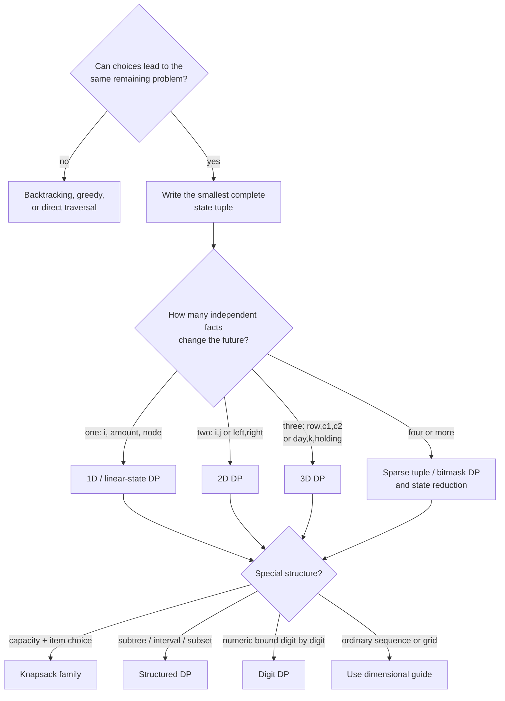

# Chapter 9 · Dynamic programming

Dynamic programming is **exhaustive search over a state graph, with each
repeated state solved once**. The hard part is not filling a table. It is
deciding which histories have the same future and may safely share one answer.

## The DP recognition test

Ask these questions before writing `dp`:

1. **Choices:** can the solution be described as a sequence of decisions?
2. **Repeated future:** can different decision histories reach the same
   remaining problem?
3. **Complete state:** can a small tuple capture everything that changes future
   legal moves or value?
4. **Progress:** does every transition move toward a base case?

If the first two answers are yes, memoized search is a strong first model. If
each state has only one incoming history, memoization may add no value. If
transitions can cycle without a decreasing resource, model a graph algorithm
instead of forcing DP.



## Dimension is about state, not input

A matrix problem is not automatically 2D DP, and an array problem is not
automatically 1D DP.

| State contract | Dimension | Typical pattern |
| --- | ---: | --- |
| `dp[i]` = answer for the first `i` values | 1D | take/skip, stairs, LIS |
| `dp[amount]` = best way to make `amount` | 1D | coin change |
| `dp[i][j]` = answer for two prefixes | 2D | LCS, edit distance |
| `dp[left][right]` = answer inside an interval | 2D | interval DP |
| `dp[row][c1][c2]` = two agents after `row` | 3D | Cherry Pickup II |
| `dp[day][used][holding]` = trading state | 3D | bounded stock trades |
| `(pos, tight, started, mask)` | 4D tuple | digit DP |
| `(node, parent_taken)` | logical 2D | tree DP |

Count only **independent** facts. In a two-robot grid, both robots are on the
same row after the same number of moves, so `(row, c1, c2)` is sufficient;
storing both row coordinates would be redundant.

## The solve-before-code workflow


For each problem, write this sentence:

> `solve(state)` returns ___ for exactly ___, assuming ___.

Then complete the five-part definition:

1. **State** — the exact meaning of every coordinate.
2. **Transition** — each legal decision and the next state it creates.
3. **Base** — solved terminal states and impossible states.
4. **Order** — why dependencies are ready before a state reads them.
5. **Answer** — the precise state or aggregate the problem requests.

The [state-design workshop](state_design.md) applies this method step by step.

## Pattern router

| Problem signal | First model | Detailed guide |
| --- | --- | --- |
| choose or skip along one sequence | `dp[i]` or two rolling values | [1D DP](one_dimensional.md) |
| transform/compare two strings | `dp[i][j]` over prefixes | [2D DP](two_dimensional.md) |
| move through a grid | `dp[row][column]` | [2D DP](two_dimensional.md) |
| two synchronized agents | `dp[step][position1][position2]` | [3D DP](three_dimensional.md) |
| bounded actions plus mode | `dp[time][budget][mode]` | [3D DP](three_dimensional.md) |
| use each item once or repeatedly | capacity DP + deliberate loop direction | [Knapsack families](knapsack_families.md) |
| choose the final split inside a range | `dp[left][right]` | [Structured DP](structured_dp.md) |
| result from child subtrees | return a small state vector per node | [Structured DP](structured_dp.md) |
| `n` is around 15–22 and chosen set matters | `dp[mask]` or `dp[mask][last]` | [Higher-dimensional DP](higher_dimensional.md) |
| count values up to a huge numeric bound | digit position + bound flags + property | [Higher-dimensional DP](higher_dimensional.md) |
| need the actual choices, not only the score | parent/choice pointers | [Optimization and reconstruction](optimization_reconstruction.md) |

## Memoization or tabulation?

| Top-down memoization | Bottom-up tabulation |
| --- | --- |
| mirrors the decision recurrence | makes dependency order explicit |
| visits only reachable states | usually fills the declared state space |
| handles irregular tuple states naturally | has predictable memory access |
| risks call-stack depth | supports rolling-array compression easily |

They are two evaluation strategies for the same state graph. Start with the one
that makes correctness easiest to explain. Convert only for recursion depth,
constant factors, memory layout, or reconstruction.

## Detailed guides

- [State design and proof](state_design.md)
- [1D DP: sequences, take/skip, and amounts](one_dimensional.md)
- [2D DP: grids, two strings, and intervals](two_dimensional.md)
- [3D DP: two agents, resources, and state machines](three_dimensional.md)
- [Higher-dimensional, sparse, bitmask, and digit DP](higher_dimensional.md)
- [Knapsack families and loop direction](knapsack_families.md)
- [Interval, tree, DAG, subset, and game DP](structured_dp.md)
- [Space optimization, reconstruction, and debugging](optimization_reconstruction.md)

## Tested anchor: 0/1 knapsack

For each item `(weight, value)`, update capacity in descending order.

**State:** `best[c]` is the best value with capacity at most `c` using items
processed so far.

**Invariant:** before `best[c]` is written, `best[c - weight]` still belongs to
the previous item layer. Ascending order would reuse the current item and solve
unbounded knapsack instead.

=== "Python"

    ```python
    --8<-- "codes/python/dsa_atlas/dp.py:knapsack"
    ```

=== "C++17"

    ```cpp
    --8<-- "codes/cpp/include/dsa_atlas/algorithms.hpp:knapsack"
    ```

=== "C++11"

    ```cpp
    --8<-- "codes/cpp/include/dsa_atlas/algorithms.hpp:knapsack"
    ```

## Source-grounded practice

The examples are organized against the official
[LeetCode Dynamic Programming study plan](https://leetcode.com/studyplan/dynamic-programming/)
and HackerRank’s
[Dynamic Programming interview kit](https://www.hackerrank.com/interview/interview-preparation-kit/dynamic-programming/challenges).
The state-first method follows MIT’s view of DP as subproblems plus guesses in a
dependency DAG:
[Dynamic Programming Subproblems](https://ocw.mit.edu/courses/6-006-introduction-to-algorithms-spring-2020/28461a74f81101874a13d9679a40584d_MIT6_006S20_lec16.pdf).

!!! note "Practice rule"

    Do not memorize a table shape from a solution. For every practice problem,
    write the state contract and recurrence before opening an editor.
