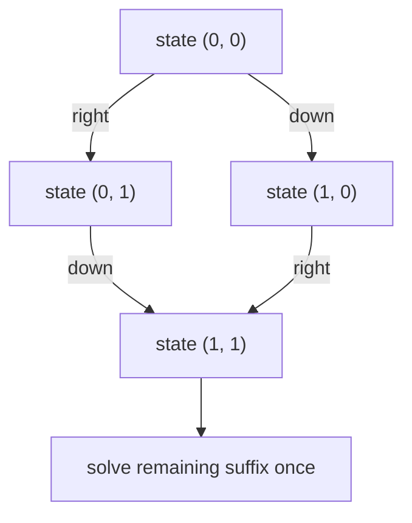
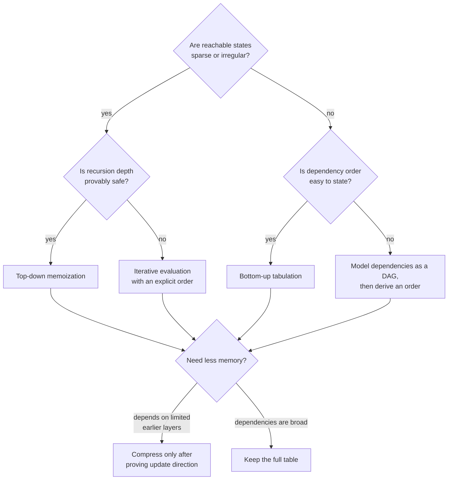
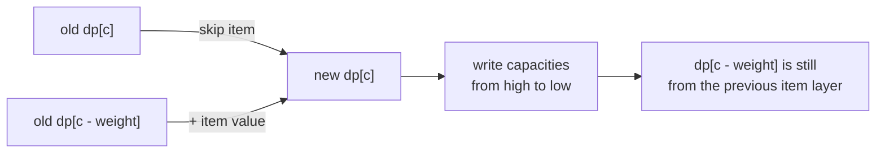

# Chapter 9 · Dynamic programming

Dynamic programming is exhaustive search over a state graph with repeated
states evaluated once.

Two different histories may reach the same future. If the state description
contains everything that future decisions need, those histories can merge:



If two merged histories would have different legal moves or future value, the
state is missing a variable and must be refined.

## The five-part definition

Before code, write:

1. **State:** exactly what `dp[...]` means.
2. **Transition:** which smaller states produce it.
3. **Base case:** the smallest solved states.
4. **Order:** why dependencies are ready when read.
5. **Answer:** which state or aggregate to return.

## Memoization or tabulation?

| Top-down memoization | Bottom-up tabulation |
| --- | --- |
| natural from recurrence | explicit evaluation order |
| visits reachable states | usually fills full state space |
| recursion overhead | easy space compression |
| good for sparse states | predictable memory access |



Memoization and tabulation evaluate the same recurrence. The choice changes
which states are visited, how evaluation order is enforced, and whether call
stack depth is part of the risk.

## 0/1 knapsack

For each item `(weight, value)`, update capacities in descending order.

**State:** `dp[c]` is the best value with capacity at most `c` using only items
processed so far.

**Why descending?** Reading `dp[c - weight]` must refer to the previous item
layer. Ascending order would permit the current item multiple times and solve
unbounded knapsack instead.



=== "Python"

    ```python
    --8<-- "codes/python/dsa_atlas/dp.py:knapsack"
    ```

=== "C++17"

    ```cpp
    --8<-- "codes/cpp/include/dsa_atlas/algorithms.hpp:knapsack"
    ```

## State-design questions

- Which information from the past changes future legal moves?
- Can two histories with the same chosen state variables always share an
  optimal continuation?
- Is a dimension derivable from the others?
- Does the answer require exact capacity/length or at most capacity/length?
- Are impossible states represented distinctly from a zero-value state?

## Space compression warning

Compress only after identifying the dependency direction. A one-dimensional
array changes in place, so loop order becomes part of correctness, not merely
an optimization detail.
