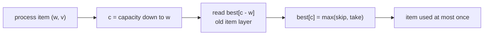
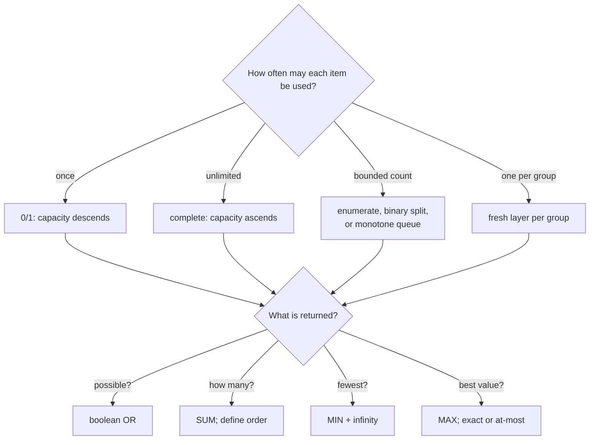

# Knapsack families · Capacity and loop direction

Knapsack is not one template. It is a family whose variants differ in item
multiplicity, exactness, objective, and whether order matters.

## Start with the contract

Choose one:

- `best[c]` = maximum value with capacity **at most** `c`;
- `best[c]` = maximum value with total weight **exactly** `c`;
- `possible[c]` = whether exact weight `c` is reachable;
- `ways[c]` = number of constructions for exact weight `c`;
- `fewest[c]` = minimum number of items for exact weight `c`.

The initialization follows the words:

| Contract | `state[0]` | Other states |
| --- | ---: | ---: |
| max value, at most capacity | `0` | `0` |
| max value, exact capacity | `0` | negative infinity |
| feasibility, exact | `true` | `false` |
| count exact constructions | `1` | `0` |
| minimum items, exact | `0` | positive infinity |

## 0/1 knapsack · Each item once

Natural 2D recurrence:

```text
dp[i][c] = max(
    dp[i - 1][c],
    dp[i - 1][c - weight[i]] + value[i]
)
```

When compressed to one array, iterate capacity downward.



=== "Python"

    ```python
    --8<-- "codes/python/dsa_atlas/dp.py:knapsack"
    ```

=== "C++17"

    ```cpp
    --8<-- "codes/cpp/include/dsa_atlas/algorithms.hpp:knapsack"
    ```

## Complete or unbounded knapsack · Reuse allowed

Iterate capacity upward so `best[c - weight]` may already include the current
item:

```text
for each item:
    for c from weight to capacity:
        best[c] = improve(best[c], best[c - weight] + contribution)
```

LeetCode
[Coin Change](https://leetcode.com/problems/coin-change/)
asks for the minimum reusable coins, so the combine operation is MIN rather
than MAX.

=== "Python"

    ```python
    --8<-- "codes/python/dsa_atlas/dp.py:coin-change"
    ```

=== "C++17"

    ```cpp
    --8<-- "codes/cpp/include/dsa_atlas/algorithms.hpp:coin-change"
    ```

## Counting: combinations versus sequences

For reusable coins:

```text
// Combinations: [1,2] and [2,1] are the same.
for coin in coins:
    for amount from coin upward:
        ways[amount] += ways[amount - coin]

// Ordered sequences: [1,2] and [2,1] are different.
for amount from 1 upward:
    for coin in coins:
        ways[amount] += ways[amount - coin]
```

The inner loop represents the final choice. Changing loop order changes which
partial constructions are available, so it changes the problem solved.

## Bounded knapsack · Each item has a count

If an item may be used at most `count` times:

1. **Direct enumeration:** try `0..count` copies per state. Simple, potentially
   slow.
2. **Binary splitting:** replace `count` copies with 0/1 bundles of sizes
   `1, 2, 4, ...`, plus a remainder.
3. **Monotone-queue optimization:** advanced option when capacity is large and
   transition structure supports it.

Binary splitting turns multiplicity `13` into bundles `1, 2, 4, 6`; every use
count from `0..13` can be represented by choosing bundles.

## Subset sum and partition

Subset sum is 0/1 feasibility:

```text
possible[0] = true
for value in values:
    for sum from target down to value:
        possible[sum] |= possible[sum - value]
```

Descending order is essential. For equal partition, the target is half the
total sum; reject odd totals first.

If values can be negative, array indices no longer map directly to sums. Use an
offset or a set/map of reachable sums, and include the enlarged range in the
complexity.

## Multiple-choice and grouped knapsack

When at most one option may be chosen from each group, every new group must read
the table from before that group. Copy the old layer or use a fresh layer; an
ordinary item loop can accidentally choose multiple options from one group.

**Invariant:** `new[c]` uses zero or one choice from the current group plus a
solution from completed earlier groups.

## Multiple resources

For weight and volume:

```text
dp[weight][volume] = best value
```

For 0/1 items, descend both axes. Complexity is
`O(items × weight_limit × volume_limit)`, and memory is the product of the two
limits.

## Chooser



## Knapsack review checklist

- Is capacity exact or merely an upper bound?
- May the empty selection be the answer?
- How many times may each item be used?
- Does order distinguish solutions?
- Which operation combines candidates: OR, SUM, MIN, or MAX?
- What does the impossible sentinel mean?
- Does every compressed loop read the intended item layer?
