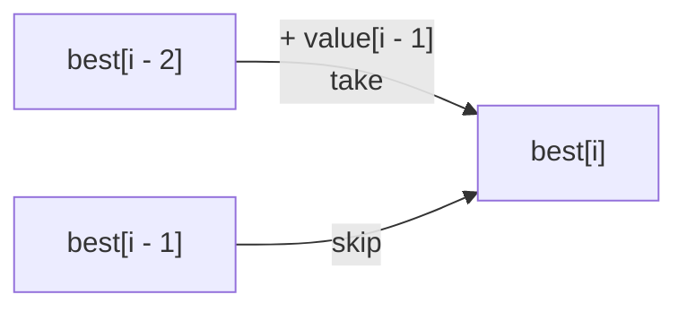

# 1D DP · Sequences, choices, and amounts

Use 1D DP when one coordinate fully identifies the remaining future: an index,
prefix length, amount, time, or node in a DAG.

## Pattern A · Take or skip

The official HackerRank
[Max Array Sum](https://www.hackerrank.com/challenges/max-array-sum/problem)
asks for a maximum-sum subset with no adjacent elements. The same recurrence
drives LeetCode
[House Robber](https://leetcode.com/problems/house-robber/).

**State:** `best[i]` is the best sum using the first `i` values.

**Transition:**

```text
best[i] = max(
    best[i - 1],                 # skip value i - 1
    best[i - 2] + value[i - 1]  # take it
)
```



Only two older states are read, so the table can be compressed to two values.
The names `take_previous` and `skip_previous` make the invariant clearer than
`a` and `b`.

=== "Python"

    ```python
    --8<-- "codes/python/dsa_atlas/dp.py:non-adjacent"
    ```

=== "C++17"

    ```cpp
    --8<-- "codes/cpp/include/dsa_atlas/algorithms.hpp:non-adjacent"
    ```

### Thinking variations

- **Circular sequence:** first and last conflict. Solve two linear cases:
  exclude first, then exclude last.
- **Must choose at least one:** the empty answer `0` is no longer valid; change
  base cases or initialize from the first element.
- **Cannot choose within distance `d`:** taking `i` reads `best[i-d-1]`.
- **Return chosen indices:** keep the table or a choice pointer; two rolling
  values are insufficient for reconstruction.

## Pattern B · Count paths or constructions

Counting stairs has state `ways[i]` = number of ways to reach step `i`.

```text
ways[i] = ways[i - 1] + ways[i - 2]
ways[0] = 1
```

The base `ways[0] = 1` means “one empty construction.” It is not claiming there
is one physical step. This distinction appears throughout counting DP.

Ask:

- Does order matter? `1+2` and `2+1` may be different sequences.
- Are objects reusable?
- Must the target be exact?
- Is a modulus required?

Changing loop order can change the mathematical object counted. In coin-change
counting, iterating coins outside counts combinations; iterating amount outside
usually counts ordered sequences.

## Pattern C · Minimum cost for an amount

LeetCode
[Coin Change](https://leetcode.com/problems/coin-change/)
uses `best[x]` = minimum reusable coins needed to make **exactly** `x`.

```text
best[0] = 0
best[x] = 1 + min(best[x - coin]) for every coin <= x
```

Unreachable amounts need an infinity sentinel, not zero.

=== "Python"

    ```python
    --8<-- "codes/python/dsa_atlas/dp.py:coin-change"
    ```

=== "C++17"

    ```cpp
    --8<-- "codes/cpp/include/dsa_atlas/algorithms.hpp:coin-change"
    ```

### Do not confuse these coin problems

| Requested result | State value | Combine |
| --- | --- | --- |
| feasibility | boolean reachable | OR |
| minimum coins | minimum count | MIN |
| number of combinations | count | SUM |
| number of ordered sequences | count | SUM, different loop order |
| maximum value under capacity | best score | MAX |

They may share the same index or amount coordinate but have different
semirings—different base values and combine operations.

## Pattern D · Ending-at states

Sometimes `dp[i]` means the best solution **ending at** `i`, not within the
first `i` values.

For an `O(n²)` longest increasing subsequence:

```text
dp[i] = 1 + max(dp[j]) for every j < i with values[j] < values[i]
answer = max(dp[i])
```

The answer is an aggregate over all ending states, not necessarily `dp[n-1]`.
This is a common source of otherwise correct-looking bugs.

## Pattern E · Small state machine over time

A sequence can have a small mode such as “holding” or “not holding.” Logically,
`dp[day][mode]` is 2D, but when the mode count is constant it is often written
as a few named 1D rolling states.

For stock with a transaction fee:

```text
cash' = max(cash, hold + price - fee)  # keep cash or sell
hold' = max(hold, cash - price)        # keep stock or buy
```

Read both new values from the previous day. Updating `cash` and then using that
new value to update `hold` changes the transition graph.

## 1D decision checklist

Use a single coordinate only if:

- it determines which choices remain;
- earlier details cannot change future legality;
- the answer can be expressed from earlier/later positions;
- the state count fits the numeric constraint.

If the choice also depends on capacity, a second sequence, or a mode with
nonconstant range, add that coordinate rather than hiding it.

## Practice ladder

1. [House Robber](https://leetcode.com/problems/house-robber/) — take/skip.
2. [Max Array Sum](https://www.hackerrank.com/challenges/max-array-sum/problem)
   — empty-choice semantics and negative values.
3. [Coin Change](https://leetcode.com/problems/coin-change/) — minimum exact
   amount.
4. [Candies](https://www.hackerrank.com/challenges/candies) — directional
   constraints; solve two 1D passes rather than forcing a recurrence.
5. [Longest Increasing Subsequence](https://leetcode.com/problems/longest-increasing-subsequence/)
   — ending-at DP, then compare with the `O(n log n)` greedy/binary-search
   optimization.
