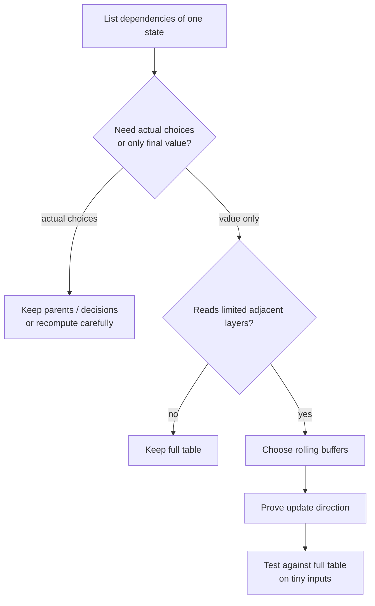

# DP optimization, reconstruction, and debugging

First make the state contract and recurrence correct. Then optimize the
representation without changing the state graph.

## Space compression proof

Ask exactly which earlier layers a state reads.

| Dependency | Possible storage |
| --- | --- |
| previous one or two scalar states | rolling variables |
| previous row only | two rows |
| previous row and current left cell | one row with careful order |
| previous item layer | one capacity array with proven direction |
| arbitrary shorter intervals | usually full `O(n²)` table |
| parent pointers needed | retain table or store separate decisions |



### In-place overwrite audit

For each assignment `dp[x] = ...`:

1. mark whether each right-side read is from the old or current layer;
2. choose a loop order preserving those versions;
3. check equal-index/self-transition cases;
4. test one item or one row by hand.

This is why 0/1 knapsack descends and complete knapsack ascends.

## Reconstruct the actual solution

A score table does not automatically reveal the chosen path.

### Parent pointer method

Store which predecessor produced each state:

```text
if candidate_from_take improves dp[state]:
    dp[state] = candidate_from_take
    parent[state] = previous_state
    action[state] = TAKE
```

Starting from the answer state, follow parents backward and reverse the actions.

### Recompute decisions from the table

For LCS:

- if final characters match and the diagonal relation holds, take the
  character and move diagonally;
- otherwise move to a neighbor with the same optimal value.

This saves a parent table but still requires the full value table.

### Divide-and-conquer reconstruction

Some problems, including LCS, can reconstruct with reduced memory using more
advanced divide-and-conquer techniques. Prefer the full-table method unless
memory constraints require the complexity.

## Top-down versus bottom-up in practice

### Prefer top-down when

- only a small fraction of tuple states is reachable;
- base cases and decisions are easier to express recursively;
- state topology is irregular;
- pruning removes large parts of the search.

### Prefer bottom-up when

- recursion depth may exceed the language stack;
- state space is dense;
- a simple index, interval-length, postorder, or topological order exists;
- rolling-array memory is important;
- low constant factors matter.

Python recursion is particularly risky for linear depth; C++ also has no
portable guarantee of deep recursion safety. Memoization prevents repeated
calls, not deep call stacks.

## Debugging with a state table

Use the smallest input that exercises every transition.

1. Write the state meaning above the table.
2. Fill terminal or boundary states manually.
3. Select one non-base state.
4. List every legal decision and next state.
5. Compute the expected value.
6. Compare with the program.

```mermaid
flowchart LR
  accTitle: Debugging a dynamic-programming recurrence
  accDescr: Begin with a tiny counterexample, verify the state contract and bases, enumerate legal transitions for the first wrong state, then check evaluation order and answer extraction. Only after those pass should implementation details be investigated.
  A["small failing input"] --> B["contract correct?"]
  B --> C["base / impossible states?"]
  C --> D["all and only legal transitions?"]
  D --> E["dependencies ready?"]
  E --> F["correct answer state?"]
  F --> G["implementation detail"]
```



## Common failure patterns

| Symptom | Likely cause |
| --- | --- |
| result too large | reused a 0/1 item; double-counted a shared cell |
| result too small | omitted a transition; invalid base rejects a valid empty choice |
| impossible case looks optimal | zero used as an unreachable maximum state |
| count multiplied unexpectedly | loop order counts permutations instead of combinations |
| memo gives inconsistent answers | cache key omits a future-relevant fact |
| tabulation differs from memoization | wrong evaluation or in-place update order |
| final cell is wrong but table looks right | answer should be max/sum over states |
| stack overflow | top-down depth is linear or worse |
| memory limit exceeded | dense allocation includes mostly unreachable tuples |

## Complexity audit

Write:

```text
coordinate ranges:
  index: n
  budget: k + 1
  mode: 2

states: O(nk)
transitions/state: O(1)
time: O(nk)
memo/table: O(nk)
stack or rolling buffer: O(n) stack or O(k) layer
```

Avoid “time is `O(n)` because there is one loop” when recursion or a nested
transition enumerates additional states.

## A disciplined practice session

For each new problem:

1. spend five minutes drawing the brute-force decisions;
2. state the recursive contract aloud;
3. memoize the complete state;
4. calculate state count and transition count;
5. test it against brute force on tiny random inputs;
6. convert to tabulation if needed;
7. compress space only after recording dependency direction;
8. reconstruct choices if the prompt asks for them.

The official
[LeetCode Dynamic Programming study plan](https://leetcode.com/studyplan/dynamic-programming/)
and HackerRank
[Dynamic Programming interview kit](https://www.hackerrank.com/interview/interview-preparation-kit/dynamic-programming/challenges)
provide a useful problem ladder. Treat their topic tags as practice grouping,
not as a substitute for deriving the state yourself.
