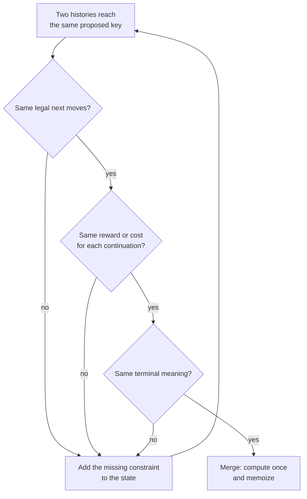
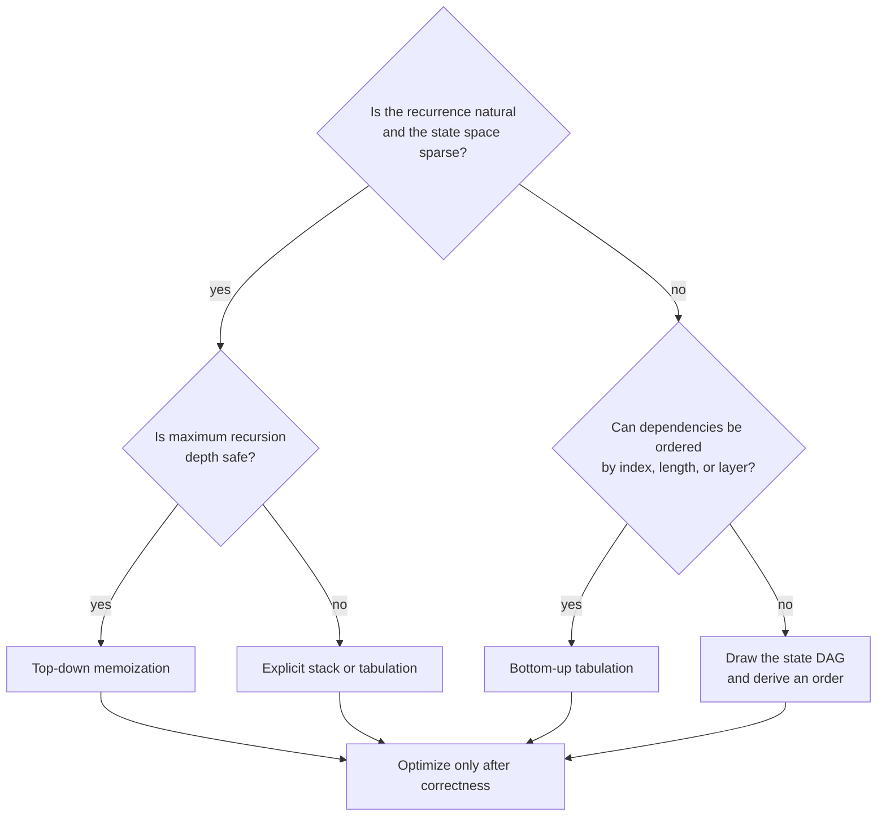

# Dynamic-programming state design

A correct DP state is a **future-equivalence key**: two histories may share one
cached answer only when every legal continuation from them has the same value.

## Step 1 · Start from decisions

Do not begin with “Should this be a 2D array?” Begin with the slow recursive
search:

- What decision is available now?
- How does each decision change the remaining problem?
- When is the process finished?

For House Robber, at index `i`:

- skip house `i` → solve from `i + 1`;
- take house `i` → earn `value[i]`, then solve from `i + 2`.

This immediately gives a contract:

> `solve(i)` returns the maximum money obtainable from houses `i...n-1`,
> assuming the previous house was not taken.

The assumption is encoded by jumping two positions after “take,” so no extra
boolean is necessary.

## Step 2 · Apply the merge test



Common missing facts include:

- remaining capacity or actions;
- whether an item is held, used, or started;
- the previous choice when adjacency matters;
- a bitmask of objects already used;
- both agents’ positions;
- whether a numeric prefix still equals the upper bound.

Common redundant facts include:

- the accumulated score when the function can return future score;
- an agent’s row when it equals the common time step;
- the number of used items when `popcount(mask)` derives it;
- a parent pointer when recursion already prevents moving upward.

## Step 3 · Write the recurrence as a contract

For the take/skip example:

```text
solve(i) = max(
    solve(i + 1),              # skip i
    value[i] + solve(i + 2)    # take i
)
solve(i) = 0 when i >= n
answer = solve(0)
```

Every term must have the same meaning as the left side. Mixing “best value for
an exact amount” with “best value for at most an amount” is a contract error,
not a syntax error.

## Step 4 · Separate impossible from zero

Zero is a valid score in many problems. It must not also mean “unreachable.”

| Objective | Safe impossible sentinel |
| --- | --- |
| maximize score | negative infinity |
| minimize cost | positive infinity |
| count ways | zero ways |
| feasibility | `false` / absent state |

Guard arithmetic with infinities: never add an edge cost or reward to an
unreachable state without checking it first.

## Step 5 · Count before coding

The standard bound is:

> time = number of reachable states × transitions tried per state

> space = cached states + recursion stack or table layers

For `(row, c1, c2)` with `R` rows, `C` columns, and nine move pairs, time is
`O(R × C² × 9) = O(RC²)` and cached space is `O(RC²)`.

For `(mask, last)` over `n` items, there are `2ⁿ × n` possible states; trying
every unused next item gives `O(2ⁿn²)` time. Writing “2D DP” hides the
exponential bitmask domain, so always multiply coordinate sizes.

## Step 6 · Choose evaluation direction



Typical orders are:

- increasing prefix length;
- decreasing suffix index;
- increasing interval length;
- postorder on a tree;
- topological order on a DAG;
- increasing subset mask when transitions only add bits.

## Reusable memoization skeleton

This is a shape, not a problem solution. Replace the state fields and decisions.

=== "Python"

    ```python
    from functools import cache

    def solve_problem(data):
        @cache
        def solve(index, remaining, mode):
            # Terminal states define the recursive contract.
            if index == len(data):
                return 0 if remaining == 0 else float("-inf")

            # Skipping preserves every state field except progress.
            best = solve(index + 1, remaining, mode)

            if legal_to_take(data[index], remaining, mode):
                # Taking must update every fact changed by this decision.
                best = max(
                    best,
                    reward(data[index])
                    + solve(
                        index + 1,
                        remaining - cost(data[index]),
                        next_mode(mode),
                    ),
                )
            return best

        return solve(0, initial_budget, initial_mode)
    ```

=== "C++17"

    ```cpp
    // Encode the complete state as a tuple or a small integer key.
    std::map<std::tuple<int, int, int>, long long> memo;

    std::function<long long(int, int, int)> solve =
        [&] (int index, int remaining, int mode) -> long long {
      // Terminal states must distinguish valid completion from impossible.
      if (index == static_cast<int>(data.size())) {
        return remaining == 0 ? 0 : NEGATIVE_INFINITY;
      }

      const auto key = std::tuple{index, remaining, mode};
      if (const auto found = memo.find(key); found != memo.end()) {
        return found->second;  // Reuse this future-equivalent state.
      }

      long long best = solve(index + 1, remaining, mode);
      if (legal_to_take(data[index], remaining, mode)) {
        best = std::max(
            best,
            reward(data[index]) +
                solve(index + 1, remaining - cost(data[index]),
                      next_mode(mode)));
      }
      return memo[key] = best;
    };
    ```

## State review checklist

Before accepting a recurrence:

- Can I say exactly what the function returns in one sentence?
- If two histories share the key, are their future choices identical?
- Can any coordinate be derived from the others?
- Does every transition progress toward a base case?
- Are impossible and zero-value states distinct?
- Which state contains the requested answer?
- Is the product of coordinate sizes within the constraints?

MIT’s
[Dynamic Programming Subproblems](https://ocw.mit.edu/courses/6-006/introduction-to-algorithms-spring-2020/28461a74f81101874a13d9679a40584d_MIT6_006S20_lec16.pdf)
uses the same discipline: choose subproblems containing the full state, relate
them through guesses, specify a topological order and base cases, then identify
the original problem.
