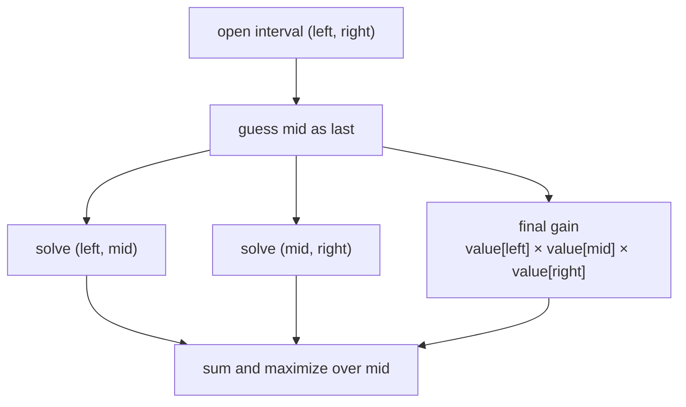
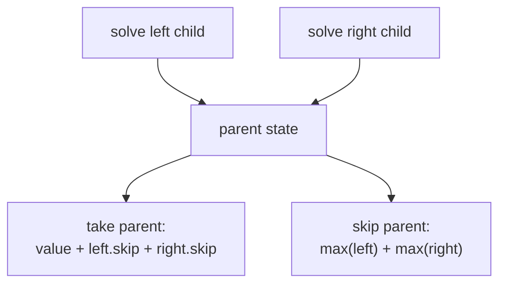

# Structured DP · Intervals, trees, DAGs, subsets, and games

Some DP families are better recognized by the structure connecting states than
by the number of array dimensions.

## Interval DP · Guess the final split

LeetCode
[Burst Balloons](https://leetcode.com/problems/burst-balloons/)
looks difficult when guessing the first balloon: its neighbors change. Guessing
the **last** balloon in an interval fixes those neighbors.

Add boundary balloons of value `1`.

> `dp[left][right]` = maximum coins from bursting balloons strictly between
> boundary indices `left` and `right`.

If `mid` is last:

```text
dp[left][right] = max(
    dp[left][mid]
    + value[left] * value[mid] * value[right]
    + dp[mid][right]
) for left < mid < right
```



Evaluate by increasing interval length. There are `O(n²)` intervals and `O(n)`
split guesses, so time is `O(n³)` and space is `O(n²)`.

### Interval signals

- removing or merging elements changes neighbors;
- choose the last operation rather than the first;
- answer for a range splits into two independent subranges;
- game choices come from either end.

## Tree DP · Return a state vector per subtree

LeetCode
[House Robber III](https://leetcode.com/problems/house-robber-iii/)
places the adjacency constraint on a tree.

For each node, return:

- `skip` = best subtree value when this node is not taken;
- `take` = best subtree value when this node is taken.

```text
left_skip, left_take = solve(node.left)
right_skip, right_take = solve(node.right)

take = node.value + left_skip + right_skip
skip = max(left_skip, left_take) + max(right_skip, right_take)
```



The parent does not need the full tables of descendants—only the summary that
affects its decision. This “small vector returned from each child” pattern also
solves:

- tree matching;
- vertex cover variants;
- maximum independent set on a tree;
- subtree selection with a bounded count;
- rerooting DP when an answer is needed for every possible root.

## DAG DP · Generalized sequence order

A sequence DP is a DAG whose edges move forward by index. On an explicit DAG:

1. topologically sort vertices;
2. initialize source or terminal states;
3. relax transitions in topological order.

Examples:

- number of paths in a DAG;
- longest weighted path in a DAG;
- scheduling with prerequisites;
- LIS as edges from smaller earlier values to larger later values.

If the graph has cycles, ordinary one-pass DAG DP is invalid. A decreasing
resource may unroll cycles into layers; otherwise choose a shortest-path,
fixed-point, or graph-specific algorithm.

## Subset DP · Exponential but intentional

Use a bitmask when the identity of used objects changes future choices and `n`
is small.

Typical contracts:

- `dp[mask]` = best answer using exactly the chosen set;
- `dp[mask][last]` = best answer using the set and ending at `last`;
- `dp[mask]` = remainder or progress inside the current group.

LeetCode
[Partition to K Equal Sum Subsets](https://leetcode.com/problems/partition-to-k-equal-sum-subsets/)
permits `n <= 16`, making `2ⁿ` states plausible.

Do not report subset DP as simply `O(n²)` because its table has two visible
indices. State range, not bracket count, determines complexity.

## Game or minimax DP

For two-player optimal play, define whose payoff is returned.

A clean contract often uses score difference:

> `dp[state]` = maximum `(current player score - other player score)` achievable
> from this state.

Taking reward `x` and handing the rest to the opponent gives:

```text
candidate = x - dp[next_state]
dp[state] = max(candidate choices)
```

The subtraction automatically alternates perspective and avoids a separate
player dimension.

For interval end-picking:

```text
dp[left][right] = max(
    value[left] - dp[left + 1][right],
    value[right] - dp[left][right - 1]
)
```

This is an example of state reduction: “whose turn” is derivable from interval
length or absorbed into the value definition.

## Pattern chooser

| Structure of decisions | State shape | Evaluation order |
| --- | --- | --- |
| split a continuous range | `(left, right)` | increasing interval length |
| combine child subtrees | `(node, small mode)` | postorder |
| explicit acyclic dependencies | `node` or `(node, resource)` | topological |
| exact chosen set matters | `mask` plus optional endpoint | increasing masks / memo |
| alternating optimal players | interval/configuration, score difference | shorter states first |

The transferable skill is to expose the state graph. The table is merely one
storage representation.
