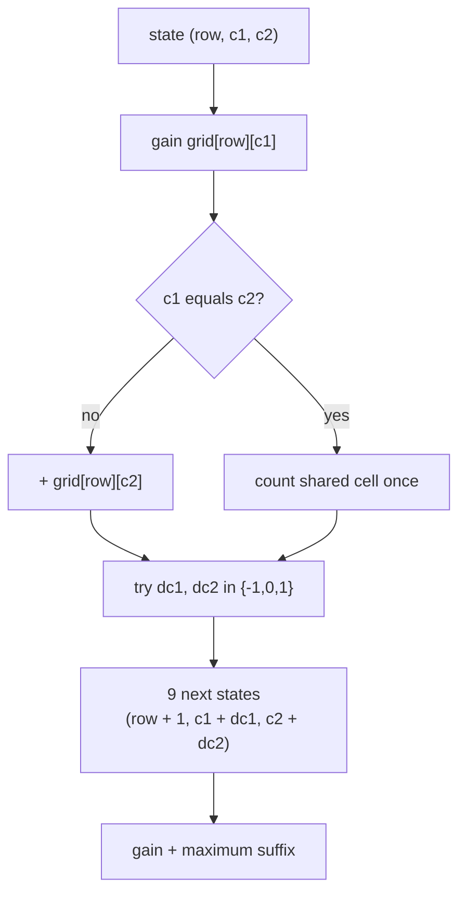
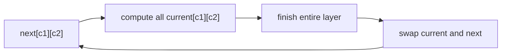

# 3D DP · Agents, resources, and state machines

Use 3D DP only when three independent facts change future legal moves or value.
The main danger is not syntax; it is allowing the product of coordinate sizes to
grow without checking it.

## Worked model · Two synchronized robots

LeetCode
[Cherry Pickup II](https://leetcode.com/problems/cherry-pickup-ii/)
places two robots on the top row. Each moves down-left, down, or down-right.

After `row` moves, both robots are on that same row. Therefore:

> `solve(row, c1, c2)` = maximum cherries collectable from `row` onward when
> robot 1 is at column `c1` and robot 2 is at column `c2`.

Storing `(r1, c1, r2, c2)` would be a redundant 4D state because `r1 == r2`.



### Recurrence

```text
gain(row, c1, c2) =
    grid[row][c1]                              if c1 == c2
    grid[row][c1] + grid[row][c2]             otherwise

solve(row, c1, c2) =
    gain + max solve(row + 1, c1 + d1, c2 + d2)
               for d1,d2 in {-1,0,1}
```

Out-of-bounds states return negative infinity so they cannot win a maximum.
The last row returns its gain with no further move.

### Complexity

- states: `R × C × C`;
- transitions per state: at most `3 × 3 = 9`;
- time: `O(RC²)`;
- memo space: `O(RC²)`;
- bottom-up rolling-layer space: `O(C²)`.

=== "Python"

    ```python
    --8<-- "codes/python/dsa_atlas/dp.py:cherry-pickup"
    ```

=== "C++17"

    ```cpp
    --8<-- "codes/cpp/include/dsa_atlas/algorithms.hpp:cherry-pickup"
    ```

=== "C++11"

    ```cpp
    --8<-- "codes/cpp/include/dsa_atlas/algorithms.hpp:cherry-pickup"
    ```

## Pattern A · Time × budget × mode

LeetCode
[Best Time to Buy and Sell Stock IV](https://leetcode.com/problems/best-time-to-buy-and-sell-stock-iv/)
permits at most `k` transactions.

One valid contract is:

> `solve(day, remaining_sales, holding)` = maximum future profit from `day`
> onward, given whether one share is held.

Decisions:

| Mode | Choice | Cash change | Next mode |
| --- | --- | ---: | --- |
| not holding | skip | `0` | not holding |
| not holding | buy | `-price[day]` | holding |
| holding | hold | `0` | holding |
| holding | sell | `+price[day]` | not holding, one fewer sale |

```mermaid
stateDiagram-v2
  accTitle: Stock dynamic programming as a bounded state machine
  accDescr: On each day, the not-holding state may skip or buy, while the holding state may hold or sell. A sale consumes one transaction from the remaining budget. Every transition advances to the next day.
  state "not holding" as Cash
  state "holding" as Hold
  Cash --> Cash: skip / 0
  Cash --> Hold: buy / -price
  Hold --> Hold: hold / 0
  Hold --> Cash: sell / +price; use one sale
```



The dimension sizes are `n × (k + 1) × 2`, so time is `O(nk)` and the constant
mode dimension can be represented by two arrays of length `k + 1`.

### State-definition choice

You may count:

- completed transactions;
- remaining transactions;
- buys used;
- sells used.

Any can work, but transitions and base cases must match exactly. Saying “used
transactions” while decrementing it is a semantic bug.

## Pattern B · Item × resource A × resource B

Two-budget knapsack might store:

> `dp[i][a][b]` = best value using the first `i` items within budgets `a` and
> `b`.

The natural complexity is `O(items × A × B)`. If each item is 0/1, both resource
loops descend when compressing the item dimension:

```text
for each item (cost_a, cost_b, value):
    for a from A down to cost_a:
        for b from B down to cost_b:
            dp[a][b] = max(dp[a][b],
                           dp[a-cost_a][b-cost_b] + value)
```

Descending only one resource can still reuse the item through the other axis.

## Pattern C · Position × state × remaining changes

Many problems add a bounded exception:

- sequence index;
- current mode/category;
- number of edits or switches remaining.

Examples include changing at most `k` values, choosing at most `k` segments, or
matching strings with a bounded error budget.

Before adding the third coordinate, ask whether it can be derived:

- if every transition consumes exactly one step, “steps used” may equal index;
- if remaining budget equals `total - used`, keep one, not both;
- if the mode has only two values, named rolling arrays may be clearer than a
  literal 3D table.

## Memory compression

If every state at layer `t` reads only layer `t + 1` or `t - 1`, keep two 2D
layers.



Do not compress when:

- transitions read multiple nonadjacent layers;
- reconstruction needs the full predecessor relation;
- in-place update order is not proven;
- the full table already fits and clarity matters more.

## 3D review checklist

- What does each coordinate represent?
- Can any coordinate be derived from another?
- What is the product of their ranges?
- How many transitions are tried per state?
- Is a dense array realistic, or are reachable states sparse?
- Can one progress layer be rolled safely?

“3D” is not automatically advanced. A precise `O(nk × 2)` state may be simpler
and faster than an unclear 1D recurrence.
