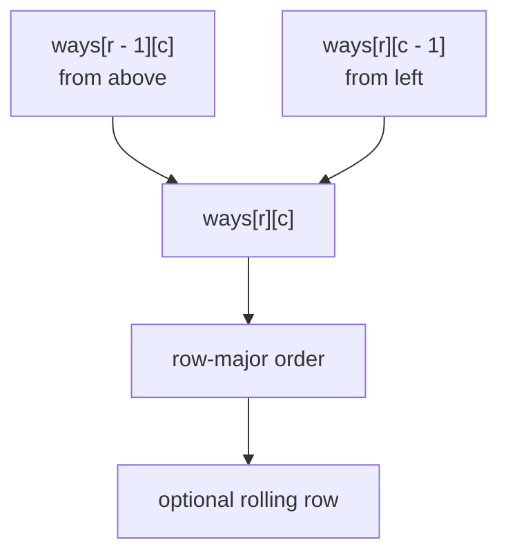
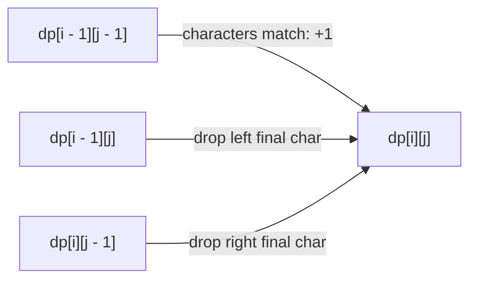
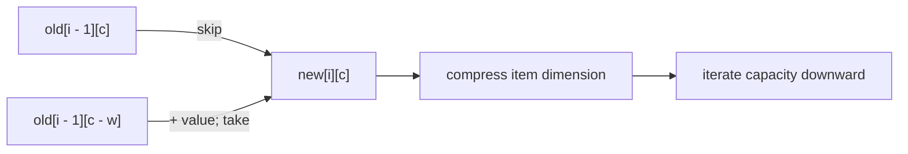

# 2D DP · Grids, two sequences, and intervals

Use 2D DP when two independent coordinates are required to describe the future.
The table geometry should come from the state contract, not from the input’s
appearance.

## Family A · Grid position

LeetCode
[Unique Paths](https://leetcode.com/problems/unique-paths/)
has one robot, so `(row, column)` determines every legal continuation.

**State:** `ways[r][c]` = number of paths from the start to cell `(r, c)`.

```text
ways[r][c] = ways[r - 1][c] + ways[r][c - 1]
```



For minimum path sum, replace SUM with MIN and add the current cell cost. For
obstacles, set blocked states to zero ways or infinity cost.

### Boundary technique

Choose one of these deliberately:

- explicit first row and first column;
- a padded border with one seed state;
- bounds checks in the transition.

Padding often reduces branches, but the seed must match the contract. For
counting paths, setting one virtual predecessor of the start to `1` produces
the correct start value.

## Family B · Two prefixes

LeetCode
[Longest Common Subsequence](https://leetcode.com/problems/longest-common-subsequence/)
uses:

**State:** `dp[i][j]` = LCS length between `left[:i]` and `right[:j]`.

```text
if left[i - 1] == right[j - 1]:
    dp[i][j] = 1 + dp[i - 1][j - 1]
else:
    dp[i][j] = max(dp[i - 1][j], dp[i][j - 1])
```

The empty-prefix row and column are base cases with value zero.



=== "Python"

    ```python
    --8<-- "codes/python/dsa_atlas/dp.py:lcs"
    ```

=== "C++17"

    ```cpp
    --8<-- "codes/cpp/include/dsa_atlas/algorithms.hpp:lcs"
    ```

=== "C++11"

    ```cpp
    --8<-- "codes/cpp/include/dsa_atlas/algorithms.hpp:lcs"
    ```

The implementation stores only the previous and current rows. To reconstruct
an actual subsequence, retain the full table or store parent choices.

### The two-string family

| Problem | State value | When characters match | Otherwise |
| --- | --- | --- | --- |
| LCS | maximum kept length | diagonal + 1 | max(up, left) |
| edit distance | minimum operations | diagonal | 1 + min(diagonal, up, left) |
| distinct subsequences | number of matches | skip + use | skip |
| interleaving strings | feasible prefix split | read matching predecessor(s) | false |

For official practice, see
[Edit Distance](https://leetcode.com/problems/edit-distance/). The dimensions
may match LCS, but the state meaning, base row/column, and combine operation do
not.

## Family C · Interval DP

`dp[left][right]` describes a contiguous interval. Unlike prefix DP, both
boundaries change.

Typical signals:

- choose the first or last element;
- choose the final operation inside a range;
- split a range at every possible `mid`;
- merge adjacent segments.

Intervals are usually evaluated by increasing length:

```text
for length = 1..n:
    for left:
        right = left + length - 1
        compute dp[left][right] from shorter intervals
```

LeetCode
[Burst Balloons](https://leetcode.com/problems/burst-balloons/)
becomes tractable when you guess which balloon is burst **last** in an interval.
At that moment the interval boundaries are fixed neighbors. The
[structured DP guide](structured_dp.md) works through this reversal.

## Family D · Item and capacity

The natural 0/1-knapsack state is:

> `dp[i][capacity]` = best value using the first `i` items.

It is 2D even though the final implementation may compress away `i`.



See [Knapsack families](knapsack_families.md) before changing loop order:
descending capacity means “use once,” while ascending capacity permits reuse.

## Choose the correct evaluation order

| Dependencies | Safe order |
| --- | --- |
| above and left | rows top-to-bottom, columns left-to-right |
| below and right | rows bottom-to-top, columns right-to-left |
| shorter intervals | increasing interval length |
| previous item layer | any capacity order with two layers |
| same array, 0/1 item | descending capacity |
| same array, reusable item | ascending capacity |

An order is a proof: when a cell is read, its value must already represent the
correct dependency layer.

## 2D debugging method

For a tiny example:

1. label every axis with its exact prefix, coordinate, or boundary meaning;
2. fill base row and column by hand;
3. annotate one interior cell with each predecessor;
4. verify whether the requested answer is a corner, maximum, or sum;
5. only then compare with code.

Most 2D bugs are semantic off-by-one errors: mixing character index `i` with
prefix length `i`, or using an inclusive right boundary in one place and an
exclusive boundary in another.
