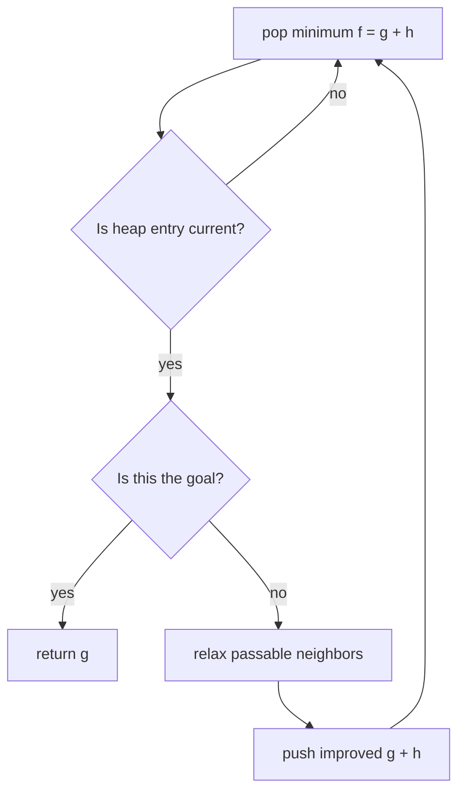

# A* heuristic search

A* is Dijkstra ordered by `f(state) = g(state) + h(state)`: known path cost plus
a lower bound on remaining cost. It helps when the target is specific and the
heuristic focuses exploration.

## Correctness contract

- `h(state) ≥ 0`.
- `h(goal) = 0`.
- **Admissible:** `h` never overestimates the true remaining cost.
- Prefer **consistent:** `h(u) ≤ cost(u,v) + h(v)` for every edge. Then a state
  need not be reopened after its best priority is finalized under the usual
  implementation.



For four-direction unit-cost movement, Manhattan distance is admissible because
each move changes row or column by only one.

## Tested grid template

=== "Python"

    ```python
    --8<-- "codes/python/dsa_atlas/graph.py:a-star-grid"
    ```

=== "C++17"

    ```cpp
    --8<-- "codes/cpp/include/dsa_atlas/algorithms.hpp:a-star-grid"
    ```

=== "C++11"

    ```cpp
    --8<-- "codes/cpp/include/dsa_atlas/algorithms.hpp:a-star-grid"
    ```

## Choose A*, Dijkstra, or BFS

| Situation | Choice |
| --- | --- |
| Unit edges, no useful heuristic | BFS |
| Nonnegative edges, many targets/all distances | Dijkstra |
| One target, nonnegative edges, strong lower bound | A* |
| Negative edge | Bellman–Ford or another suitable model |

Worst-case work remains comparable to Dijkstra when the heuristic gives no
guidance. An overestimating heuristic may be faster but can lose optimality.

## Practice

- [LeetCode: Shortest Path in Binary Matrix](https://leetcode.com/problems/shortest-path-in-binary-matrix/)
- [LeetCode: Minimum Cost to Make at Least One Valid Path in a Grid](https://leetcode.com/problems/minimum-cost-to-make-at-least-one-valid-path-in-a-grid/)
