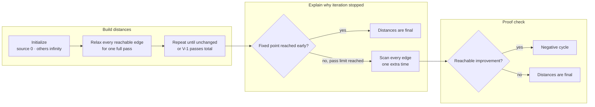

# Bellman–Ford

Use Bellman–Ford for single-source shortest paths when directed edges may have
negative weight and reachable negative cycles must be detected.

## Why Dijkstra is invalid

Dijkstra finalizes the next smallest tentative distance. A later negative edge
can improve a vertex that appeared final, breaking that proof. Bellman–Ford
does not finalize vertices early; it repeatedly relaxes every edge.

## State and invariant

`distance[v]` is the best length found from the source to `v`.

After pass `i`, every shortest path using at most `i` edges has been accounted
for. Any simple shortest path contains at most `V - 1` edges, so `V - 1`
passes are enough when no reachable negative cycle exists.



Read each full edge scan as one DP layer: it permits shortest paths with one
more edge. The final scan is a proof check, not another distance-building pass.

## Annotated blueprint

```text
distance[*] = infinity
distance[source] = 0

repeat V - 1 times:
    changed = false
    for each directed edge (u, v, weight):
        if distance[u] is infinity: continue       # edge is unreachable
        if distance[u] + weight < distance[v]:
            distance[v] = distance[u] + weight     # relax one more edge
            changed = true
    if not changed: break                          # fixed point reached early

for each edge (u, v, weight):
    if reachable u can still improve v:
        report a reachable negative cycle
```

The reachability guard matters: a negative cycle in a disconnected component
does not invalidate distances from this source.

## Worked signal

Currency exchange can use `-log(rate)` as an edge weight. A negative cycle then
represents a product of exchange rates greater than one—an arbitrage cycle.

## Complexity and traps

- Time: `O(VE)`.
- Extra space: `O(V)` without path reconstruction.
- Use a safe infinity sentinel and guard before addition.
- Decide whether to return a negative-cycle flag, raise an error, or recover
  the cycle.
- Do not confuse “negative edge exists” with “reachable negative cycle exists.”

## Reference

- [Princeton: shortest paths and Bellman–Ford](https://algs4.cs.princeton.edu/44sp/)
- [Princeton: Bellman–Ford reference implementation](https://algs4.cs.princeton.edu/code/edu/princeton/cs/algs4/BellmanFordSP.java.html)

## Tested template

=== "Python"

    ```python
    --8<-- "codes/python/dsa_atlas/graph.py:bellman-ford"
    ```

=== "C++17"

    ```cpp
    --8<-- "codes/cpp/include/dsa_atlas/algorithms.hpp:bellman-ford"
    ```

=== "C++11"

    ```cpp
    --8<-- "codes/cpp/include/dsa_atlas/algorithms.hpp:bellman-ford"
    ```

The tested contract raises only for a negative cycle reachable from `source`;
an unreachable negative cycle cannot affect those distances.
