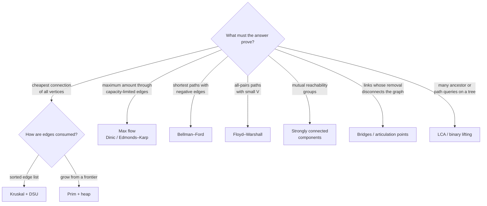
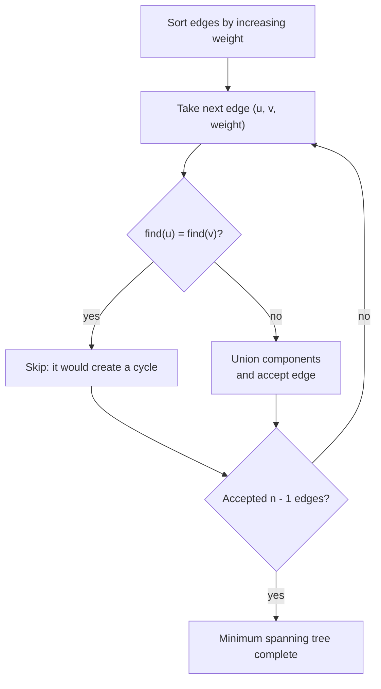

# Chapter 10 · Advanced graphs

Advanced graph selection starts with the result that must be proved.

| Objective | Key condition | Candidate |
| --- | --- | --- |
| connect all vertices cheaply | undirected weighted graph | [Kruskal / Prim MST](minimum_spanning_trees.md) |
| move maximum amount | capacities | [max flow](network_flow.md) |
| shortest paths with negative edges | reachable negative cycles matter | [Bellman–Ford](bellman_ford.md) |
| all-pairs paths, small `V` | dense or repeated queries | [Floyd–Warshall](floyd_warshall.md) |
| mutual reachability groups | directed graph | [SCC](strongly_connected_components.md) |
| critical undirected links | connectivity after removal | [bridge / articulation DFS](bridges_articulation_points.md) |
| repeated ancestor queries | static rooted tree | [LCA with binary lifting](lca_binary_lifting.md) |



This selection begins with the output contract. Edge direction, weights,
capacities, graph size, and number of queries then remove invalid candidates.

## Detailed guides

Each guide separates recognition, proof, template, complexity, and failure
cases:

- [Minimum spanning trees](minimum_spanning_trees.md): cut property, Kruskal
  versus Prim, and disconnected inputs.
- [Network flow](network_flow.md): residual edges, augmenting paths, min-cut,
  and matching reductions.
- [Bellman–Ford](bellman_ford.md): negative edges and reachable negative-cycle
  detection.
- [Floyd–Warshall](floyd_warshall.md): the intermediate-vertex DP state for
  all-pairs paths.
- [Strongly connected components](strongly_connected_components.md):
  Kosaraju and the condensation DAG.
- [Bridges and articulation points](bridges_articulation_points.md): discovery
  times, low links, parallel edges, and root handling.
- [LCA and binary lifting](lca_binary_lifting.md): preprocessing a static tree
  for repeated ancestor queries.

## Tested example: minimum spanning tree

Kruskal sorts edges by weight and accepts an edge only when it joins different
components.



**Invariant:** accepted edges form a forest that can still be extended to a
minimum spanning tree.

The disjoint-set structure makes cycle checks nearly constant amortized time.
After processing, exactly `n - 1` accepted edges are required for a connected
graph.

=== "Python"

    ```python
    --8<-- "codes/python/dsa_atlas/structures.py:disjoint-set"
    --8<-- "codes/python/dsa_atlas/graph.py:kruskal"
    ```

=== "C++17"

    ```cpp
    --8<-- "codes/cpp/include/dsa_atlas/algorithms.hpp:disjoint-set"
    --8<-- "codes/cpp/include/dsa_atlas/algorithms.hpp:kruskal"
    ```

The implementations validate every endpoint, accept negative edge weights, and
reject a disconnected graph instead of silently returning a forest. The
[complete MST guide](minimum_spanning_trees.md) explains when Prim is the
better representation.

!!! warning "Copy-ready policy"

    Pseudocode is labeled as explanation. Only implementations under `codes/`
    are promised to compile or import in the current release.

## Primary references

The selection table and complexity checks are cross-checked against Princeton's
[Algorithms and Data Structures Cheatsheet](https://algs4.cs.princeton.edu/cheatsheet/),
[minimum-spanning-tree chapter](https://algs4.cs.princeton.edu/43mst/),
[shortest-path chapter](https://algs4.cs.princeton.edu/44sp/), and
[directed-graph chapter](https://algs4.cs.princeton.edu/42digraph/).
