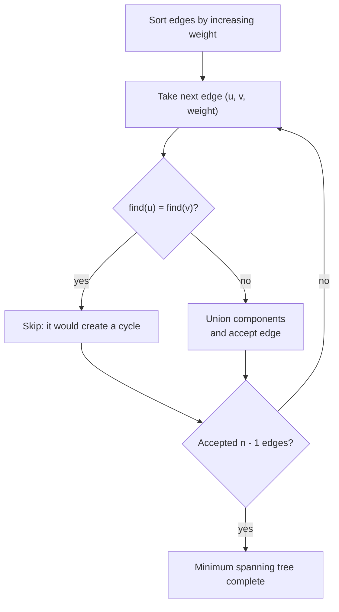

# Chapter 10 · Advanced graphs

Advanced graph selection starts with the result that must be proved.

| Objective | Key condition | Candidate |
| --- | --- | --- |
| connect all vertices cheaply | undirected weighted graph | Kruskal / Prim MST |
| move maximum amount | capacities | max flow |
| shortest paths with negative edges | reachable negative cycles matter | Bellman–Ford |
| all-pairs paths, small `V` | dense or repeated queries | Floyd–Warshall |
| mutual reachability groups | directed graph | SCC |
| critical undirected links | connectivity after removal | bridge DFS |
| repeated ancestor queries | static rooted tree | binary lifting |

## Minimum spanning tree

Kruskal sorts edges by weight and accepts an edge only when it joins different
components.



**Invariant:** accepted edges form a forest that can still be extended to a
minimum spanning tree.

The disjoint-set structure makes cycle checks nearly constant amortized time.
After processing, exactly `n - 1` accepted edges are required for a connected
graph.

=== "Python"

    ```python
    --8<-- "codes/python/dsa_atlas/structures.py:disjoint-set"
    --8<-- "codes/python/dsa_atlas/graph.py:kruskal"
    ```

=== "C++17"

    ```cpp
    --8<-- "codes/cpp/include/dsa_atlas/algorithms.hpp:disjoint-set"
    --8<-- "codes/cpp/include/dsa_atlas/algorithms.hpp:kruskal"
    ```

The implementations validate every endpoint, accept negative edge weights, and
reject a disconnected graph instead of silently returning a forest.

## Negative edges

Dijkstra is invalid when a later negative edge can improve a finalized
distance. Bellman–Ford relaxes every edge `V - 1` times; a further reachable
relaxation proves a negative cycle reachable from the source.

Guard unreachable vertices before adding a weight to an infinity sentinel.

## Bridges

During DFS:

- `tin[u]` is the discovery time of `u`;
- `low[u]` is the earliest discovery reachable from `u`'s subtree without the
  exact parent edge;
- tree edge `(u, v)` is a bridge when `low[v] > tin[u]`.

The core library includes a tested edge-ID implementation. Other advanced
algorithms remain explanatory until complete executable tests are added.

!!! warning "Copy-ready policy"

    Pseudocode is labeled as explanation. Only implementations under `codes/`
    are promised to compile or import in the current release.
