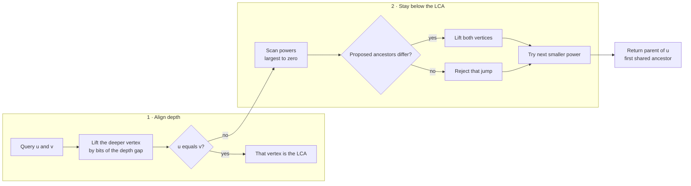

# LCA and binary lifting

The lowest common ancestor of vertices `u` and `v` is the deepest vertex that
is an ancestor of both. Binary lifting is useful when the tree is static and
many ancestor or path queries follow.

## Recognition signals

- Many queries ask for an ancestor, LCA, or distance between two tree vertices.
- The root and edges do not change between queries.
- One `O(V log V)` preprocessing pass is affordable.

For only one LCA query, a parent walk or ordinary DFS may be simpler.

## Preprocessed state

`up[k][v]` is the `2^k`-th ancestor of `v`.

```text
up[0][v] = parent[v]
up[k][v] = up[k - 1][ up[k - 1][v] ]  # two 2^(k-1) jumps
```

Also store `depth[v]`. Optionally store DFS entry and exit times when constant
time ancestor checks are useful.

## Query thinking flow

```text
lca(u, v):
    if depth[u] < depth[v]: swap(u, v)

    lift u by the binary bits of depth[u] - depth[v]
    if u == v: return u                         # v was an ancestor

    for k from largest down to zero:
        if up[k][u] != up[k][v]:
            u = up[k][u]                       # stay below the LCA
            v = up[k][v]

    return parent[u]                            # first shared ancestor
```

Descending powers are essential: each accepted jump keeps the two vertices in
different ancestor subtrees while moving them as high as safely possible.



The query has two phases with different goals: equalize depth, then maximize
safe jumps that keep `u` and `v` in different subtrees.

## Derived queries

- `k`-th ancestor: apply jumps for the set bits of `k`.
- Tree distance:
  `depth[u] + depth[v] - 2 * depth[lca(u,v)]`.
- Number of edges or vertices on a path.
- Aggregate path queries when each jump table also stores a sum, minimum,
  maximum, or other associative value.

## Complexity and traps

- Preprocessing: `O(V log V)`.
- Each LCA or ancestor query: `O(log V)`.
- Space: `O(V log V)`.
- Define the root's parent consistently, often the root itself.
- Compute enough levels: `ceil(log2(max(1, V))) + 1`.
- Validate that the input is one tree, not a disconnected graph or cyclic
  graph.
- Recursive preprocessing can overflow on a chain.

## Practice

- [LeetCode: Lowest Common Ancestor of a Binary Tree](https://leetcode.com/problems/lowest-common-ancestor-of-a-binary-tree/)

## Tested template

=== "Python"

    ```python
    --8<-- "codes/python/dsa_atlas/graph.py:binary-lifting"
    ```

=== "C++17"

    ```cpp
    --8<-- "codes/cpp/include/dsa_atlas/algorithms.hpp:binary-lifting"
    ```

=== "C++11"

    ```cpp
    --8<-- "codes/cpp/include/dsa_atlas/algorithms.hpp:binary-lifting"
    ```

Construction validates a connected acyclic input and uses an explicit stack.
Queries first align depth, then lift both vertices from the largest jump down.
