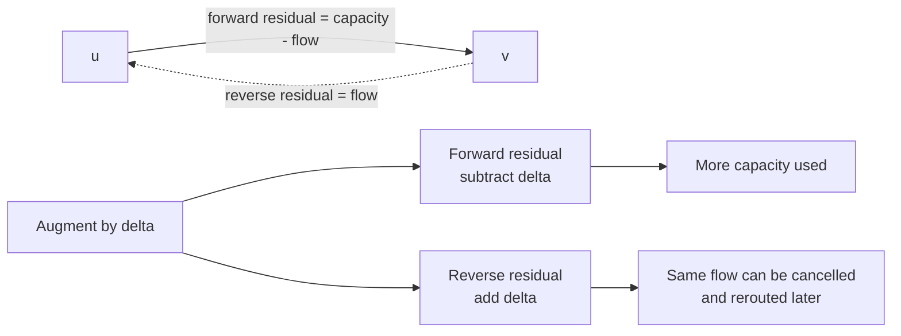

# Network flow

Use maximum flow when units move from a source to a sink through directed edges
with capacities. The answer is the largest feasible amount, not the cheapest
path.

## Model before algorithm

For every directed edge `u → v`:

- `0 ≤ flow(u,v) ≤ capacity(u,v)`;
- every internal vertex has equal incoming and outgoing flow;
- the objective is total flow leaving the source, equivalently entering the
  sink.

If a problem says “assign as many,” “route as much,” or “match the maximum
number” under pairwise capacity constraints, try a flow model.

## The residual graph

The residual graph records what can still change:

- a forward residual edge allows more flow to be sent;
- a reverse residual edge allows earlier flow to be cancelled and rerouted.

Reverse edges are not optional bookkeeping. Without them, an early valid choice
can permanently block a better global solution.



Think of the reverse edge as an undo budget. Every unit already sent forward
creates one unit of permission to revise that choice.

## Annotated Dinic blueprint

```text
add_edge(u, v, capacity):
    add forward residual edge with capacity
    add reverse residual edge with zero capacity  # enables cancellation

while BFS can reach sink:
    level[v] = shortest residual-edge distance from source
    next_edge[v] = 0                              # avoid rescanning dead edges

    while pushed = DFS(source, infinity):
        total_flow += pushed

DFS(u, available):
    if u is sink: return available
    inspect only edges with level[v] = level[u] + 1
    push min(available, residual_capacity)
    subtract pushed flow from forward edge
    add pushed flow to reverse edge               # preserve residual invariant
```

**Invariant:** every residual update preserves capacity constraints and flow
conservation.

## Algorithm choice

| Algorithm | Useful when | Typical bound |
| --- | --- | --- |
| Edmonds–Karp | learning, small graphs, simplest correctness story | `O(VE²)` |
| Dinic | general interview and contest flow | `O(V²E)` general worst case |
| Hopcroft–Karp | the model is specifically unweighted bipartite matching | `O(E√V)` |

## Common reductions

- **Bipartite matching:** source → left side → right side → sink, all capacity
  one.
- **Vertex capacity:** split `v` into `v_in → v_out` with that capacity.
- **Choose at most `k`:** place capacity `k` on the controlling edge.
- **Disjoint paths:** capacity one on each edge or split vertices for
  vertex-disjoint paths.
- **Minimum cut:** after max flow, vertices still reachable in the residual
  graph form the source side of a minimum cut.

## Failure checks

- Are capacities integral and within the numeric type?
- Did every added edge receive a paired reverse edge?
- Are parallel edges accumulated or represented separately?
- Is the graph directed as modeled, even when the story sounds symmetric?
- Does the reduction preserve “at most one” constraints on both sides?

## Reference

- [Princeton: Maximum Flow lecture](https://algs4.cs.princeton.edu/lectures/)
- [Princeton: Ford–Fulkerson API and complexity](https://algs4.cs.princeton.edu/code/javadoc/edu/princeton/cs/algs4/FordFulkerson.html)

## Tested Dinic template

=== "Python"

    ```python
    --8<-- "codes/python/dsa_atlas/graph.py:dinic"
    ```

=== "C++17"

    ```cpp
    --8<-- "codes/cpp/include/dsa_atlas/algorithms.hpp:dinic"
    ```

=== "C++11"

    ```cpp
    --8<-- "codes/cpp/include/dsa_atlas/algorithms.hpp:dinic"
    ```

The implementation keeps reverse-edge indices beside every residual edge.
Each blocking-flow phase scans only edges that advance one level.
