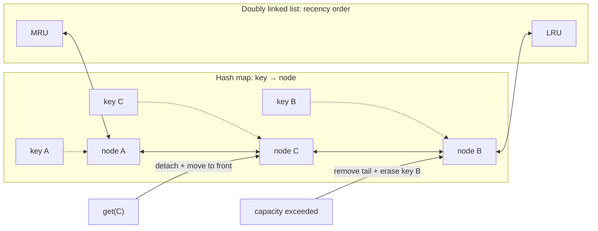
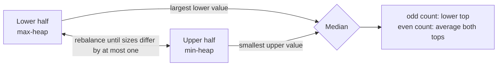

# Chapter 11 · Composite structures

Composite designs appear when no single structure makes every required
operation cheap. Assign each operation to the structure that owns it, then
define how their representations stay synchronized.

## Operation-to-owner table

| Design | Structure A | Structure B | Result |
| --- | --- | --- | --- |
| LRU cache | hash map | doubly linked list | `O(1)` lookup and recency update |
| randomized set | hash map | dynamic array | `O(1)` expected delete and random |
| streaming median | max-heap | min-heap | `O(log n)` add, `O(1)` median |
| time map | hash map | sorted history | key lookup plus binary search |
| min stack | value stack | minimum stack | `O(1)` minimum |

## LRU cache

The map owns `key → node`. The linked list owns recency order. A lookup moves
its node to the front; eviction removes the tail and deletes the same key from
the map.

**Cross-structure invariant:** every live map entry points to exactly one live
list node, and every real list node has exactly one map entry.



The map answers “where is this key?” The list answers “which key is newest or
oldest?” Every operation that inserts, moves, or removes a node must preserve
both answers.

## Randomized set

The array provides constant-time random indexing. The map stores each value's
array index. To delete from the middle:

1. move the last array value into the removed slot;
2. update that value's stored index;
3. pop the array tail;
4. erase the removed value from the map.

The order of these updates matters when the removed value is already last.

## Streaming median

Keep the lower half in a max-heap and the upper half in a min-heap.



**Invariants:**

- every lower value is at most every upper value;
- the lower heap has either the same number of elements or one more.

=== "Python"

    ```python
    --8<-- "codes/python/dsa_atlas/structures.py:median"
    ```

=== "C++17"

    ```cpp
    --8<-- "codes/cpp/include/dsa_atlas/algorithms.hpp:median"
    ```

Composite structures fail at synchronization boundaries. Tests should target
updates that touch both structures: overwriting, removing the last element,
evicting at zero/one capacity, and balancing around duplicate extremes.
