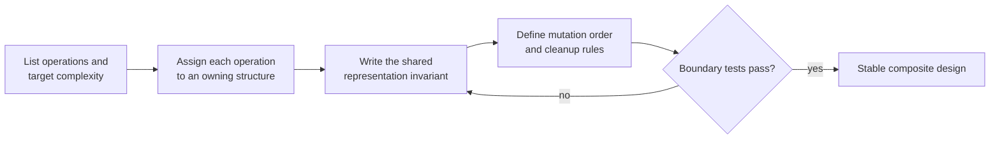

# Chapter 11 · Composite structures

Composite designs appear when no single structure makes every required
operation cheap. Assign each operation to the structure that owns it, then
define how their representations stay synchronized.

## Operation-to-owner table

| Design | Structure A | Structure B | Result |
| --- | --- | --- | --- |
| [LRU cache](lru_cache.md) | hash map | doubly linked list | `O(1)` lookup and recency update |
| [LFU cache](lfu_cache.md) | key map | frequency buckets + recency lists | `O(1)` average access and eviction |
| [randomized set](randomized_set.md) | hash map | dynamic array | `O(1)` expected delete and random |
| [streaming median](streaming_median.md) | max-heap | min-heap | `O(log n)` add, `O(1)` median |
| [time map](time_map.md) | hash map | sorted history | key lookup plus binary search |
| [min stack](min_stack.md) | value | prefix minimum | `O(1)` minimum |
| [Design Twitter](design_twitter.md) | follow graph | per-user feeds + heap merge | recent top-`k` news feed |
| [All O(1)](all_one.md) | key map | ordered count buckets | `O(1)` increment, decrement, min, max |
| [number containers](number_containers.md) | index map | per-number ordered indices | update plus smallest-index query |
| [snapshot array](snapshot_array.md) | array | per-index sorted histories | sparse versions + binary search |

## The design method

For every composite problem:

1. list the required operations and target complexity;
2. assign one structure to own each expensive operation;
3. write the cross-structure invariant;
4. specify the exact update order for every mutation;
5. test the boundary where two structures change together.



The invariant is the most important step. “Use a map and a list” is not yet a
design; “every map entry points to exactly one live list node, and every real
list node has one map entry” is testable.

## Choose by the missing operation

| Existing structure | Missing operation | Add |
| --- | --- | --- |
| array gives random indexing | `O(1)` deletion by value | value-to-index hash map |
| hash map gives direct lookup | recency or frequency order | linked bucket list |
| one heap gives one extreme | middle of a stream | opposite heap |
| current value only | historical query | append-only version history |
| ordinary stack | aggregate after pop | prefix aggregate beside each value |
| adjacency sets | global newest `k` items | heap-based `k`-way merge |

## Detailed problem guides

Seven guides include tested C++11, C++17, and Python implementations:

- [LRU cache](lru_cache.md)
- [Randomized set](randomized_set.md)
- [Streaming median](streaming_median.md)
- [Time-based key-value store](time_map.md)
- [Min stack](min_stack.md)
- [Number containers](number_containers.md)
- [Snapshot array](snapshot_array.md)

The remaining guides focus on the ownership model and mutation order for more
complex interview designs:

- [LFU cache](lfu_cache.md)
- [Design Twitter](design_twitter.md)
- [All O(1) data structure](all_one.md)

Composite structures most often fail at synchronization boundaries. Test
overwriting, deleting the last array element, moving between buckets, removing
an empty bucket, zero/one capacity, duplicate extremes, and queries before the
first stored version.

## Tested anchor example

LRU cache is the clearest example of two structures owning different
operations while representing the same live entries:

=== "Python"

    ```python
    --8<-- "codes/python/dsa_atlas/structures.py:lru-cache"
    ```

=== "C++17"

    ```cpp
    --8<-- "codes/cpp/include/dsa_atlas/algorithms.hpp:lru-cache"
    ```

=== "C++11"

    ```cpp
    --8<-- "codes/cpp/include/dsa_atlas/algorithms.hpp:lru-cache"
    ```
