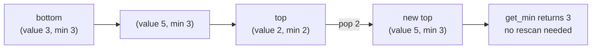

# Min stack

An ordinary stack already owns push, pop, and top. The missing operation is
restoring the correct minimum after a pop.

## State augmentation

Store each value beside the minimum of the complete stack prefix ending there:

```text
entry = (value, min(value, previous_prefix_minimum))
```

Then:

- `get_min()` reads the second field of the top entry;
- `pop()` automatically reveals the previous prefix minimum.

**Invariant:** the saved minimum in entry `i` equals the minimum of values
`0 .. i`.



The second field is a cached answer for that exact prefix. A pop restores an
older prefix and therefore restores its answer in the same operation.

## Tested templates

=== "Python"

    ```python
    --8<-- "codes/python/dsa_atlas/structures.py:min-stack"
    ```

=== "C++17"

    ```cpp
    --8<-- "codes/cpp/include/dsa_atlas/algorithms.hpp:min-stack"
    ```

=== "C++11"

    ```cpp
    --8<-- "codes/cpp/include/dsa_atlas/algorithms.hpp:min-stack"
    ```

## Alternative two-stack design

Keep one value stack and one minimum stack. Push into the minimum stack when the
new value is `≤` its top, and pop from it when the removed value equals its top.
The `≤` is necessary to preserve duplicate minima.

## Complexity and tests

- Every operation: `O(1)`.
- Space: `O(n)`.
- Test duplicate minima, removing the current minimum, negative values, and
  empty operations.

## Practice

[LeetCode: Min Stack](https://leetcode.com/problems/min-stack/)
