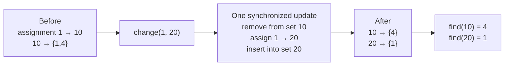

# Number containers

The system assigns numbers to indices, replaces previous assignments, and asks
for the smallest index currently holding a requested number.

## Ownership model

- `index → number` hash map owns the current assignment.
- `number → ordered indices` owns smallest-index queries.

The ordered collection may be a balanced tree. When the language lacks one, a
min-heap with lazy deletion can work.

## Eager balanced-tree update

```text
change(index, number):
    if index already has old_number:
        erase index from indices[old_number]     # remove stale ownership
        erase empty old_number collection

    assignment[index] = number
    insert index into indices[number]

find(number):
    return smallest element of indices[number], or -1
```

**Invariant:** `index` appears in exactly the ordered collection named by
`assignment[index]`.



Treat reassignment as one logical transaction: remove the old reverse fact,
replace the forward fact, then create the new reverse fact.

## Lazy-heap alternative

Push every new `(index)` into the heap for its number. During `find(number)`,
pop while `assignment[heap_top] != number`. This simplifies updates but stores
stale entries and makes cleanup query-driven.

## Complexity and traps

- Balanced-tree change: `O(log n)`; find minimum: `O(1)` or `O(log n)` by API.
- Lazy heap: `O(log n)` push and amortized cleanup.
- Reassigning an index to the same number must not corrupt membership.
- Eager deletion must remove empty per-number containers.
- Lazy deletion must verify the current assignment before returning a heap top.

## Practice

[LeetCode: Number Containers System](https://leetcode.com/problems/design-a-number-container-system/)

## Tested templates

=== "Python"

    ```python
    --8<-- "codes/python/dsa_atlas/structures.py:number-containers"
    ```

=== "C++17"

    ```cpp
    --8<-- "codes/cpp/include/dsa_atlas/algorithms.hpp:number-containers"
    ```

=== "C++11"

    ```cpp
    --8<-- "codes/cpp/include/dsa_atlas/algorithms.hpp:number-containers"
    ```

Python demonstrates lazy heap cleanup; C++ demonstrates eager `std::set`
removal. Both preserve the same smallest-index contract.
