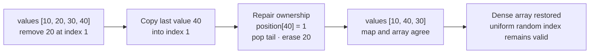

# Randomized set

The difficult operation is not insertion or random selection; it is deleting a
known value from the middle of an array without shifting a suffix.

## Ownership model

- The dynamic array owns uniform random indexing.
- The hash map owns `value → current array index`.

**Invariant:** for every index `i`, `position[values[i]] == i`, and both
structures contain exactly the same live values.

## The swap-delete idea

To remove a value at index `i`:

1. read the last value;
2. write that last value into slot `i`;
3. update its map entry to `i`;
4. pop the array tail;
5. erase the removed value's map entry.

This stays correct when the removed value is already last, but that case should
still be tested.



The order of values is deliberately disposable. Density, not sortedness or
insertion order, is what makes uniform random indexing constant time.

## Tested templates

=== "Python"

    ```python
    --8<-- "codes/python/dsa_atlas/structures.py:randomized-set"
    ```

=== "C++17"

    ```cpp
    --8<-- "codes/cpp/include/dsa_atlas/algorithms.hpp:randomized-set"
    ```

=== "C++11"

    ```cpp
    --8<-- "codes/cpp/include/dsa_atlas/algorithms.hpp:randomized-set"
    ```

## Complexity and traps

- Insert: `O(1)` expected.
- Remove: `O(1)` expected.
- Random selection: `O(1)`.
- Random selection must choose an array index uniformly.
- Define behavior for an empty set.
- After swap-delete, update the moved value's index before erasing the target.

## Practice

[LeetCode: Insert Delete GetRandom O(1)](https://leetcode.com/problems/insert-delete-getrandom-o1/)
