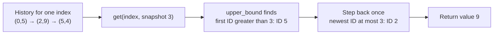

# Snapshot array

Copying the entire array on every snapshot costs `O(length × snapshots)` even
when few indices change. Store only changes.

## Ownership model

- The outer array owns one history per index.
- Each history stores sorted `(snapshot_id, value)` changes.
- A global counter owns the next snapshot ID.
- Binary search finds the last change whose ID is not after the query.

Initialize each history with `(0, 0)` so every query has a valid predecessor.

## Update blueprint

```text
set(index, value):
    history = versions[index]
    if history.last.snapshot_id == current_snapshot:
        history.last.value = value              # coalesce writes in one version
    else:
        history.append(current_snapshot, value)

snap():
    returned = current_snapshot
    current_snapshot += 1
    return returned

get(index, snapshot):
    return value at upper_bound(snapshot) - 1   # newest visible change
```

**Invariant:** each index history has strictly increasing snapshot IDs after
coalescing, and its final entry is the current value for that index.



The search is for a predecessor, not necessarily an exact version. Ask which
change was most recent **as of** the requested snapshot.

## Complexity and traps

- Set: `O(1)` amortized.
- Snap: `O(1)`.
- Get: `O(log changes_at_index)`.
- Space: `O(length + successful version changes)`.
- Coalesce repeated writes before the next snapshot.
- Validate index and snapshot ranges.
- Distinguish the current in-progress version from the last returned snapshot.

## Practice

[LeetCode: Snapshot Array](https://leetcode.com/problems/snapshot-array/)

## Tested template

=== "Python"

    ```python
    --8<-- "codes/python/dsa_atlas/structures.py:snapshot-array"
    ```

=== "C++17"

    ```cpp
    --8<-- "codes/cpp/include/dsa_atlas/algorithms.hpp:snapshot-array"
    ```

=== "C++11"

    ```cpp
    --8<-- "codes/cpp/include/dsa_atlas/algorithms.hpp:snapshot-array"
    ```

Repeated writes before `snap()` coalesce into one history entry. `get()`
right-biases its search to the newest version not after the query.
