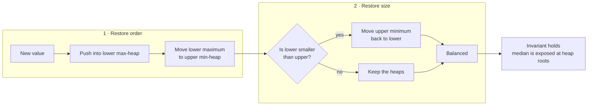

# Streaming median

A sorted array exposes the median but makes arbitrary insertion linear. Two
heaps preserve only the order information that the median requires.

## Ownership model

- A max-heap owns the lower half and exposes its largest value.
- A min-heap owns the upper half and exposes its smallest value.

**Invariants:**

1. every value in the lower heap is at most every value in the upper heap;
2. the lower heap has the same size as the upper heap or one extra element.

## Add operation

The tested template routes every new value through the lower heap, moves the
largest lower value into the upper heap, then restores the size rule. This
single sequence enforces both invariants.



Order is repaired before size. Once all lower values are no greater than all
upper values, at most one root move is needed to restore the size rule.

## Tested templates

=== "Python"

    ```python
    --8<-- "codes/python/dsa_atlas/structures.py:median"
    ```

=== "C++17"

    ```cpp
    --8<-- "codes/cpp/include/dsa_atlas/algorithms.hpp:median"
    ```

=== "C++11"

    ```cpp
    --8<-- "codes/cpp/include/dsa_atlas/algorithms.hpp:median"
    ```

## Complexity and traps

- Add: `O(log n)`.
- Median: `O(1)`.
- Empty-stream median must have explicit behavior.
- Duplicate values do not need special handling.
- In C++, convert heap tops before adding them so the average cannot overflow
  in integer arithmetic.

## Practice

[LeetCode: Find Median from Data Stream](https://leetcode.com/problems/find-median-from-data-stream/)
