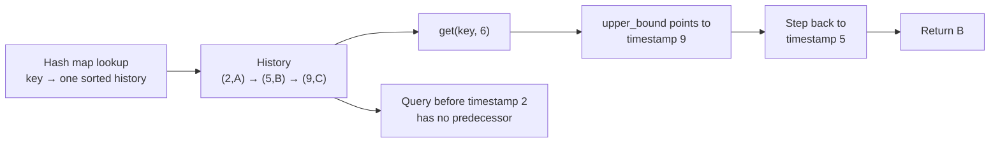

# Time-based key-value store

The query is two-dimensional: find a key, then find the newest version whose
timestamp is not after the requested time.

## Ownership model

- A hash map owns `key → version history`.
- Each history is a timestamp-sorted dynamic array.
- Binary search owns “last timestamp `≤ query`.”

When timestamps arrive in strictly increasing order for each key, insertion is
append-only and needs no tree.

**Invariant:** every key's history is strictly increasing by timestamp.

## Query contract

Use `upper_bound(query_timestamp) - 1`:

- exact timestamps are included;
- a query between versions returns the earlier one;
- a query before the first version returns no value.



Separate the two searches mentally: the hash table chooses the history, then
binary search chooses the visible version inside that history.

## Tested templates

=== "Python"

    ```python
    --8<-- "codes/python/dsa_atlas/structures.py:time-map"
    ```

=== "C++17"

    ```cpp
    --8<-- "codes/cpp/include/dsa_atlas/algorithms.hpp:time-map"
    ```

=== "C++11"

    ```cpp
    --8<-- "codes/cpp/include/dsa_atlas/algorithms.hpp:time-map"
    ```

## Complexity and traps

- Set: `O(1)` amortized under increasing timestamps.
- Get: `O(log m)` for `m` versions of that key.
- Do not use map indexing for a read in C++ if a missing key should not be
  inserted.
- If timestamps can arrive out of order, append-only history is invalid;
  maintain ordered storage or sort offline.

## Practice

[LeetCode: Time Based Key-Value Store](https://leetcode.com/problems/time-based-key-value-store/)
