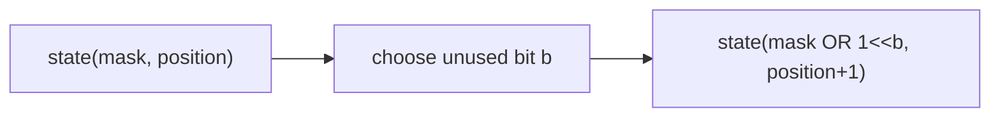

# Bit manipulation

Bits help when each state component is binary. Name what each bit means before
writing operators; compact code without a state model is difficult to verify.

## Operation map

| Need | Expression | Meaning |
| --- | --- | --- |
| Test bit `b` | `mask & (1 << b)` | Is flag `b` present? |
| Add bit `b` | `mask \| (1 << b)` | Preserve all flags and set `b` |
| Remove bit `b` | `mask & ~(1 << b)` | Preserve all flags except `b` |
| Toggle bit `b` | `mask ^ (1 << b)` | Flip exactly flag `b` |
| Lowest set bit | `mask & -mask` | Isolate the lowest active power of two |
| Clear lowest set bit | `mask & (mask - 1)` | Remove one active flag |

## Count set bits

=== "Python"

    ```python
    --8<-- "codes/python/dsa_atlas/core.py:count-set-bits"
    ```

=== "C++17"

    ```cpp
    --8<-- "codes/cpp/include/dsa_atlas/algorithms.hpp:count-set-bits"
    ```

=== "C++11"

    ```cpp
    --8<-- "codes/cpp/include/dsa_atlas/algorithms.hpp:count-set-bits"
    ```

The loop runs once per set bit: `O(popcount(value))`.

## When a mask becomes DP state



With `k` flags there are `2^k` masks. Bit packing saves representation cost; it
does not remove exponential state growth.

## Practice ladder

1. [Number of 1 Bits](https://leetcode.com/problems/number-of-1-bits/) — clear the lowest bit.
2. [Single Number](https://leetcode.com/problems/single-number/) — XOR cancellation.
3. [Subsets](https://leetcode.com/problems/subsets/) — enumerate masks.
4. [Can I Win](https://leetcode.com/problems/can-i-win/) — memoize a game by used-number mask.
