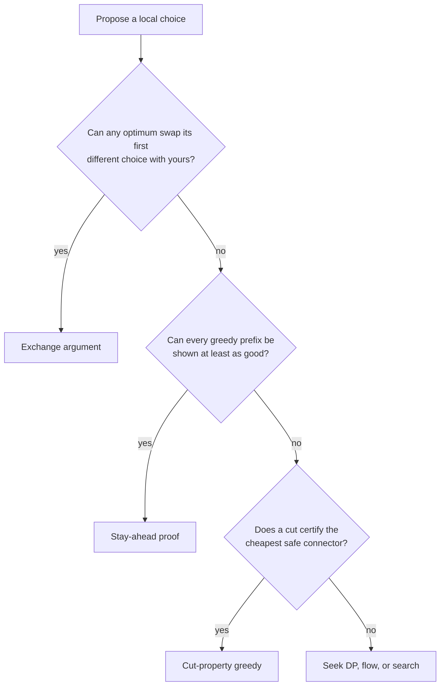

# Greedy algorithms

Greedy is not “take the largest” or “sort and hope.” It is a proof that one
locally chosen action can be part of an optimal solution.

## Proof chooser



## Interval scheduling

For the largest set of non-overlapping half-open intervals, choose the
compatible interval that ends earliest. Any optimum's first interval can be
replaced by this one without reducing space for later choices.

=== "Python"

    ```python
    --8<-- "codes/python/dsa_atlas/core.py:interval-scheduling"
    ```

=== "C++17"

    ```cpp
    --8<-- "codes/cpp/include/dsa_atlas/algorithms.hpp:interval-scheduling"
    ```

=== "C++11"

    ```cpp
    --8<-- "codes/cpp/include/dsa_atlas/algorithms.hpp:interval-scheduling"
    ```

Sorting dominates at `O(n log n)` time; the scan is `O(n)`.

## Greedy or DP?

Use greedy when the exchange keeps every future option at least as good. Use DP
when the best next choice depends on remaining capacity, parity, history, or
another state dimension. Weighted interval scheduling is the classic warning:
earliest finish maximizes count, not total weight.

## Practice ladder

1. [Assign Cookies](https://leetcode.com/problems/assign-cookies/) — match two sorted frontiers.
2. [Non-overlapping Intervals](https://leetcode.com/problems/non-overlapping-intervals/) — earliest finish.
3. [Jump Game](https://leetcode.com/problems/jump-game/) — farthest reachable prefix.
4. [Gas Station](https://leetcode.com/problems/gas-station/) — discard impossible start prefixes.
