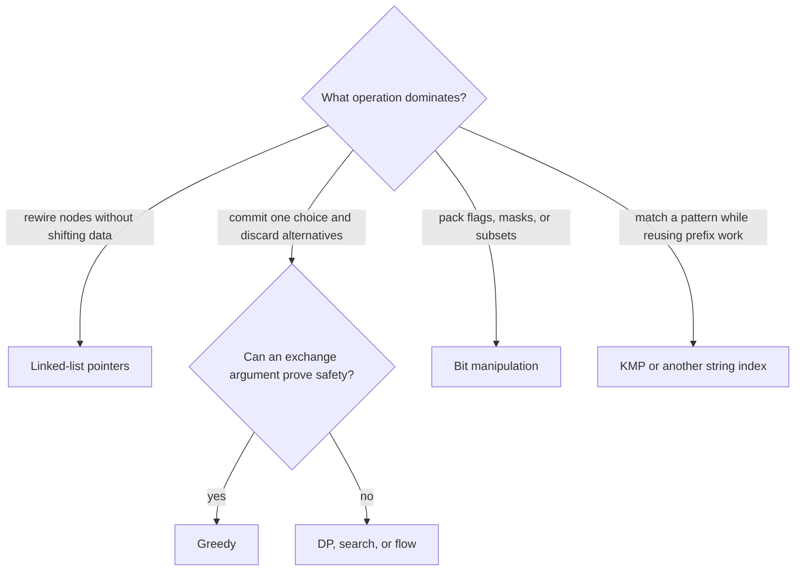

# Core interview toolkit

These topics are small enough to hide inside larger problems. Choose them from
the operation and proof you need, not from the nouns in the story.

## Thinking flow · recognize the missing primitive



## One pointer invariant to memorize

When reversing a singly linked list, the list is split into a reversed prefix
and an unread suffix. Save the suffix before overwriting `next`.

=== "Python"

    ```python
    --8<-- "codes/python/dsa_atlas/core.py:reverse-linked-list"
    ```

=== "C++17"

    ```cpp
    --8<-- "codes/cpp/include/dsa_atlas/algorithms.hpp:reverse-linked-list"
    ```

=== "C++11"

    ```cpp
    --8<-- "codes/cpp/include/dsa_atlas/algorithms.hpp:reverse-linked-list"
    ```

## Reading path

1. [Linked lists](linked_lists.md): draw ownership before changing pointers.
2. [Greedy algorithms](greedy.md): prove a local choice with exchange or stay-ahead reasoning.
3. [Bit manipulation](bit_manipulation.md): use masks only when the representation simplifies state.
4. [String matching](string_matching.md): choose KMP, Z, Trie, or rolling hash from the query shape.

Continue to the [problem catalog](../appendix/problem_catalog.md) to practice by
recognition signal instead of random difficulty.
