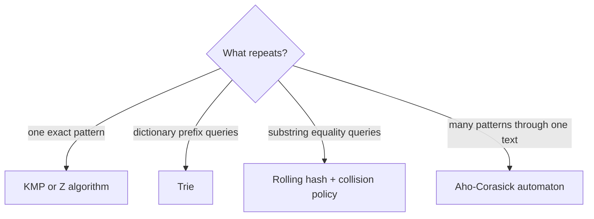

# String matching

The key question is what work repeats: one pattern against text, many prefixes,
many dictionary words, or many substring comparisons.

## Chooser



## KMP state

`longest_border[i]` is the length of the longest proper prefix of the pattern
that is also a suffix ending at `i`. On mismatch, it identifies the next viable
matched prefix without moving backward in the text.

=== "Python"

    ```python
    --8<-- "codes/python/dsa_atlas/core.py:kmp-search"
    ```

=== "C++17"

    ```cpp
    --8<-- "codes/cpp/include/dsa_atlas/algorithms.hpp:kmp-search"
    ```

=== "C++11"

    ```cpp
    --8<-- "codes/cpp/include/dsa_atlas/algorithms.hpp:kmp-search"
    ```

Preprocessing and scanning take `O(pattern + text)` time and `O(pattern)`
space.

## Failure checks

- Define the empty-pattern result.
- Distinguish characters from bytes when Unicode rules matter.
- A rolling hash is probabilistic unless collisions are verified or eliminated.
- A Trie is for prefix sharing; it does not find arbitrary substrings by itself.

## Practice ladder

1. [Find the Index of the First Occurrence in a String](https://leetcode.com/problems/find-the-index-of-the-first-occurrence-in-a-string/) — exact matching.
2. [Repeated Substring Pattern](https://leetcode.com/problems/repeated-substring-pattern/) — border structure.
3. [Longest Happy Prefix](https://leetcode.com/problems/longest-happy-prefix/) — final prefix-function value.
4. [Shortest Palindrome](https://leetcode.com/problems/shortest-palindrome/) — match a string against its reverse.
