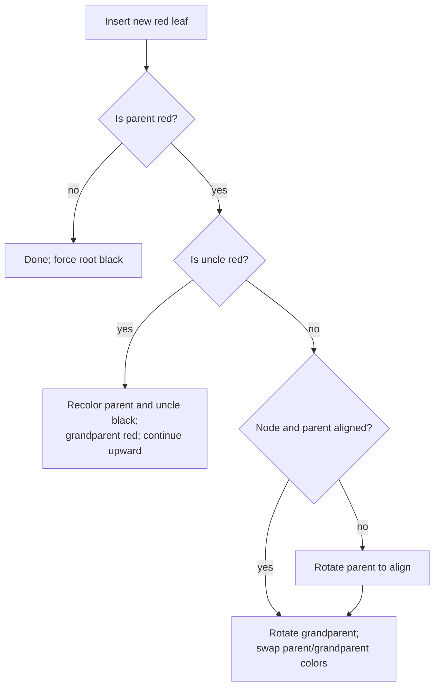

# Balanced search trees

A plain binary search tree can become a linked list. Balanced trees constrain
height so search, insertion, deletion, predecessor, and successor remain
`O(log n)`.

## Red-black invariants

1. Every node is red or black.
2. The root is black.
3. Missing leaves are treated as black.
4. A red node has black children.
5. Every path from a node to a missing leaf contains the same number of black
   nodes.

These rules imply height at most about twice the shortest root-to-leaf path.

Deletion repair is longer because removing a black node changes black height.
For interviews, explain the invariant and rotation cases unless implementation
is explicitly requested. In production C++, `std::map`/`std::set` provide the
ordered-tree contract; in Python use `bisect` over a list for small/static data
or a maintained sorted-container library when allowed.

## AVL versus red-black

| Property | AVL | Red-black |
| --- | --- | --- |
| Balance rule | Heights differ by at most one | Color/black-height rules |
| Typical height | Tighter | Slightly looser |
| Update rotations | Can be more frequent | Usually fewer |
| Good fit | Read-heavy lookup | Mixed insert/delete/search |

## Interview checklist

- Do you need predecessor/successor or sorted iteration? A hash map cannot help.
- Are keys static? Sorting once plus binary search may be simpler.
- Can coordinates be compressed? A Fenwick/segment tree may better fit numeric
  range queries.
- State whether duplicate keys are counts, separate nodes, or rejected.

## Practice

- [LeetCode: My Calendar I](https://leetcode.com/problems/my-calendar-i/)
- [LeetCode: Contains Duplicate III](https://leetcode.com/problems/contains-duplicate-iii/)
- [LeetCode: Count of Range Sum](https://leetcode.com/problems/count-of-range-sum/)
