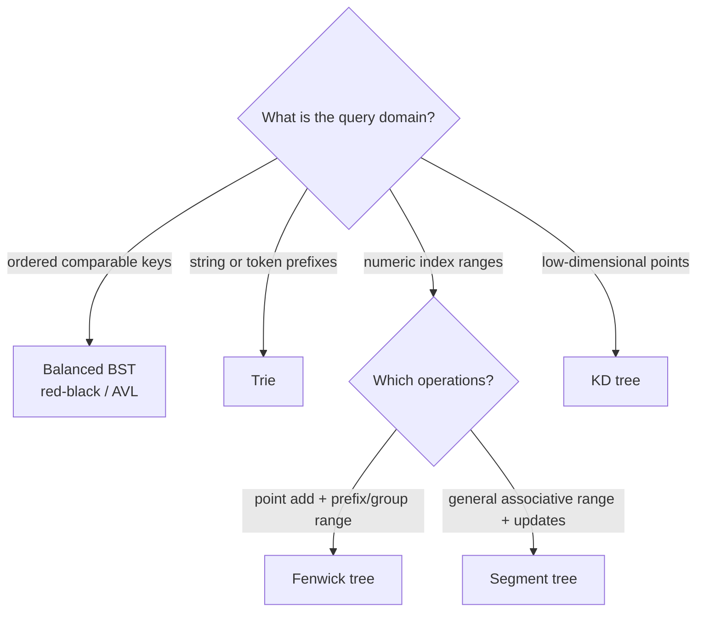

# Advanced trees

Tree names matter less than the order they preserve. Start from the operations:
ordered keys, shared prefixes, numeric ranges, or geometric regions.

## Thinking flow · choose the index



## Smallest range template

A Fenwick tree is the compact first choice for point additions and prefix sums.

=== "Python"

    ```python
    --8<-- "codes/python/dsa_atlas/advanced_trees.py:fenwick-tree"
    ```

=== "C++17"

    ```cpp
    --8<-- "codes/cpp/include/dsa_atlas/algorithms.hpp:fenwick-tree"
    ```

=== "C++11"

    ```cpp
    --8<-- "codes/cpp/include/dsa_atlas/algorithms.hpp:fenwick-tree"
    ```

## Reading path

- [Balanced search trees](balanced_search_trees.md) explains AVL versus
  red-black invariants and why standard-library ordered maps are usually safer.
- [Tries](tries.md) gives a tested prefix index.
- [Fenwick and segment trees](range_structures.md) compares range contracts.
- [KD trees](kd_trees.md) explains spatial partitioning and pruning limits.
