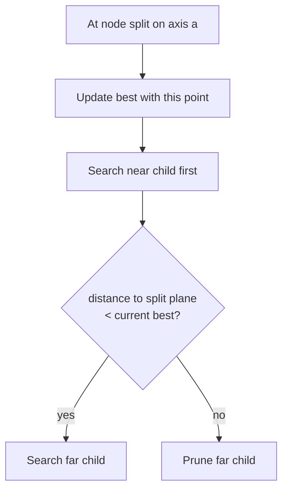

# KD trees

A KD tree recursively partitions low-dimensional points. At depth `d`, split
on coordinate `d mod dimensions`, usually around the median.

## Nearest-neighbor search

The pruning proof is geometric: every point in the far region is at least the
query-to-plane distance away. If that lower bound cannot beat the current best,
the region is irrelevant.

## Complexity and limits

- Median construction is typically `O(n log n)`.
- Balanced low-dimensional queries are often near `O(log n)` average, but the
  worst case is `O(n)`.
- Performance degrades with high dimension—the curse of dimensionality makes
  bounding boxes overlap and pruning weak.
- Frequent updates complicate balance; periodic rebuilding may be simpler.

## When not to choose it

- One-dimensional points: sort and binary search.
- Exact key membership: hash map or balanced BST.
- High-dimensional approximate search: locality-sensitive hashing or a
  specialized approximate-nearest-neighbor index may fit better.
- Rectangular aggregate queries over compressed coordinates: range trees,
  Fenwick trees, or segment trees may express the operation more directly.

## Practice and exploration

- [LeetCode: K Closest Points to Origin](https://leetcode.com/problems/k-closest-points-to-origin/) — solve first with heap/selection, then compare indexing needs.
- [LeetCode: The Skyline Problem](https://leetcode.com/problems/the-skyline-problem/) — contrast spatial stories with ordered-event solutions.

!!! note "Implementation status"

    This lesson explains construction and pruning. KD-tree code is intentionally
    conceptual because interview versions vary by dimension, metric, update
    policy, and required output.
