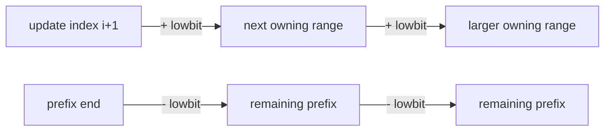

# Fenwick and segment trees

Prefix sums answer static ranges. When values change, store a hierarchy of
aggregates and update only the nodes whose ranges contain the changed index.

## Chooser

| Requirement | Prefer | Reason |
| --- | --- | --- |
| Point add + prefix/range sum | Fenwick | Small, fast, `O(n)` memory |
| Point assignment + range aggregate | Segment tree | Direct associative merging |
| Range update + point query | Fenwick difference | Two boundary updates |
| Range update + range query | Lazy segment tree | Defers whole-range work |
| Static queries only | Prefix/sparse table | Less machinery |

## Fenwick ownership



=== "Python"

    ```python
    --8<-- "codes/python/dsa_atlas/advanced_trees.py:fenwick-tree"
    ```

=== "C++17"

    ```cpp
    --8<-- "codes/cpp/include/dsa_atlas/algorithms.hpp:fenwick-tree"
    ```

=== "C++11"

    ```cpp
    --8<-- "codes/cpp/include/dsa_atlas/algorithms.hpp:fenwick-tree"
    ```

## Iterative segment tree

=== "Python"

    ```python
    --8<-- "codes/python/dsa_atlas/advanced_trees.py:segment-tree"
    ```

=== "C++17"

    ```cpp
    --8<-- "codes/cpp/include/dsa_atlas/algorithms.hpp:segment-tree"
    ```

=== "C++11"

    ```cpp
    --8<-- "codes/cpp/include/dsa_atlas/algorithms.hpp:segment-tree"
    ```

Both operations are `O(log n)`. The examples use half-open `[left, right)`
ranges; mixing inclusive and exclusive boundaries is the most common defect.

## Practice ladder

1. [Range Sum Query – Mutable](https://leetcode.com/problems/range-sum-query-mutable/)
2. [Count of Smaller Numbers After Self](https://leetcode.com/problems/count-of-smaller-numbers-after-self/)
3. [Range Module](https://leetcode.com/problems/range-module/)
4. [The Skyline Problem](https://leetcode.com/problems/the-skyline-problem/)
