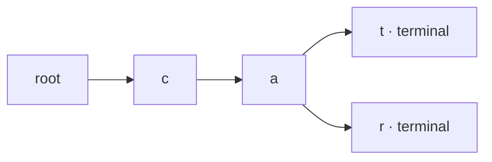

# Tries

A Trie trades memory for prefix work. Each edge consumes one character, so
lookup time depends on key length rather than the number of stored words.

## Ownership model



**Invariant:** following the characters of a stored word reaches exactly one
path, and only a terminal flag marks a complete word.

## Tested template

=== "Python"

    ```python
    --8<-- "codes/python/dsa_atlas/advanced_trees.py:trie"
    ```

=== "C++17"

    ```cpp
    --8<-- "codes/cpp/include/dsa_atlas/algorithms.hpp:trie"
    ```

=== "C++11"

    ```cpp
    --8<-- "codes/cpp/include/dsa_atlas/algorithms.hpp:trie"
    ```

Insert and lookup take `O(length)` time. Space is proportional to created
prefix nodes; dense alphabets may need compressed edges or sparse maps.

## Extensions

- Store a count at each node for prefix-frequency queries.
- Store top suggestions for autocomplete.
- Add failure links to form Aho–Corasick for many patterns in one text.
- Use a bitwise Trie for maximum-XOR queries over integers.

## Practice ladder

1. [Implement Trie](https://leetcode.com/problems/implement-trie-prefix-tree/)
2. [Design Add and Search Words](https://leetcode.com/problems/design-add-and-search-words-data-structure/)
3. [Replace Words](https://leetcode.com/problems/replace-words/)
4. [Word Search II](https://leetcode.com/problems/word-search-ii/)
